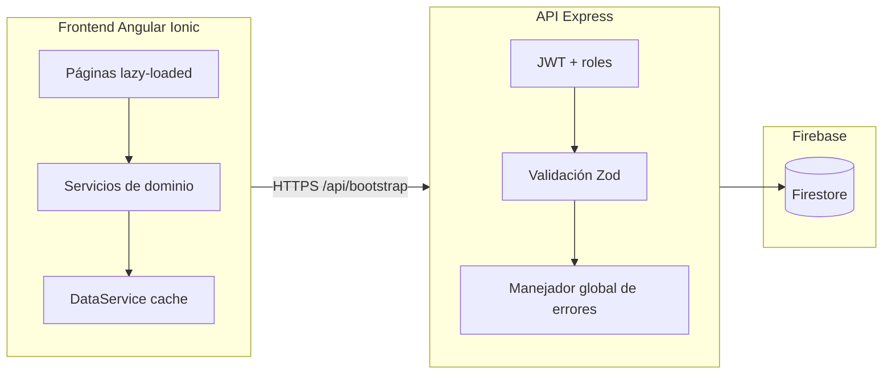

# Gestión Financiera IECA

Sistema web para la administración financiera de la **Iglesia Evangélica La Alborada (IECA)**. Permite registrar ingresos y gastos por ministerio, controlar aprobaciones, generar reportes con kardex de saldo, cerrar periodos contables y administrar usuarios con distintos niveles de acceso.

**Stack:** Angular 20 + Ionic 8 (frontend) · Node.js + Express 5 (API) · Firebase Firestore (datos) · despliegue en Firebase Hosting + Render.

### Plataforma de uso

| Ámbito | Estado |
|--------|--------|
| **Web (escritorio)** | Uso principal y despliegue actual: panel administrativo en **navegador de escritorio** (Firebase Hosting + API en Render). |
| **Vista estrecha (≤768px)** | **Soportada** en navegador (ventana reducida o teléfono vía web): sidebar off-canvas, botón ☰ en la barra superior, tablas con scroll horizontal y login centrado. No es app nativa ni PWA oficial. |
| **App móvil nativa** | **Fuera de alcance** — Capacitor 8 está en el proyecto como base técnica futura; no hay builds Android/iOS en el flujo de release. |

Los estilos responsive (`src/theme/_mobile-narrow.scss`, media queries `max-width: 768px`) **no alteran** el layout de escritorio (`min-width: 769px`).

---

## Tabla de contenidos

1. [Características](#características-principales)
2. [Arquitectura](#arquitectura)
3. [Stack tecnológico](#stack-tecnológico)
4. [Estructura del proyecto](#estructura-del-proyecto)
5. [Requisitos previos](#requisitos-previos)
6. [Instalación](#instalación)
7. [Ejecución en desarrollo](#ejecución-en-desarrollo)
8. [Roles y permisos](#roles-y-permisos)
9. [API REST](#api-rest)
10. [Alertas por correo](#alertas-por-correo)
11. [Seguridad](#seguridad)
12. [Scripts](#scripts-disponibles)
13. [Build de producción](#build-de-producción)
14. [Pruebas automatizadas](#pruebas-automatizadas)
15. [Integración continua y release](#integración-continua-y-release)
16. [Despliegue](#despliegue)
17. [Metodología del proyecto](#metodología-del-proyecto)
18. [Solución de problemas](#solución-de-problemas)
19. [Licencia](#licencia)

---

## Características principales

| Módulo | Funcionalidad |
|--------|----------------|
| **Dashboard** | KPIs (balance, ingresos, gastos, tendencias), gráficos de 6 meses, distribución por ministerio, últimos movimientos |
| **Ingresos / Gastos** | CRUD, comprobantes (imagen/PDF), filtros, aprobación/rechazo (**solo administrador**), alcance por ministerio para colaboradores, responsable del movimiento |
| **Ministerios** | CRUD de departamentos; columna **Colaboradores** (derivada de usuarios con `ministerioId`); **saldo disponible**; modal **kardex** (solo administrador) |
| **Usuarios** | Roles (`Administrador`, `Contable`, `Colaborador`), asignación de ministerio al colaborador, contraseña temporal en alta, cambio obligatorio al primer acceso |
| **Reportes** | Filtros por período (mes actual, anterior, historial, mes concreto), ministerio y tipo; resumen del período; desglose por ministerio (incluye **saldo disponible histórico** y columnas **aport. período / aport. acum.** solo admin) y por cuenta contable; **kardex** al seleccionar ministerio; exportación Excel con totales, saldos, detalle y kardex |
| **Administración** | Resumen ejecutivo, accesos rápidos, cierre mensual, backup/restauración JSON, auditoría CSV, **alertas por email**, limpieza de datos, **aportación iglesia por ministerio** (mes actual y acumulado) |
| **Notificaciones** | Pendientes y eventos del sistema |
| **Auth** | Login JWT, recuperación por código de 6 dígitos, cambio de contraseña |

### Reglas de negocio clave

- Los **colaboradores** crean movimientos en estado `pendiente`; solo el **administrador** aprueba o rechaza.
- Solo movimientos **aprobados** cuentan en balance, gráficos, reportes consolidados, **kardex** y **saldo disponible**.
- Los totales **del período** en Reportes respetan el filtro de mes/ministerio/tipo; el **saldo disponible** y el **kardex** son **históricos** (todos los movimientos aprobados del ministerio, sin filtro de mes).
- Los **periodos cerrados** bloquean altas, ediciones y borrados en ese mes.
- El **cierre mensual** marca movimientos del periodo y actualiza la configuración del sistema (por lotes de hasta 500 operaciones en Firestore).
- **Aportación iglesia (33%):** solo en ingresos de **talento** (cuenta `4105` — «Talento y eventos») con **ministerio asignado** (no `General`). Al aprobar (o crear ya aprobado como admin), se genera un **ingreso automático** en ministerio `General` por el 33%; el ministerio conserva el **67%** en saldo, kardex y KPIs. Los movimientos automáticos de aportación **no son editables ni borrables**; al eliminar el ingreso origen se elimina el ingreso de iglesia vinculado.

### Vista estrecha (navegador ≤768px)

| Pieza | Ubicación | Comportamiento |
|-------|-----------|----------------|
| `SidebarUiService` | `src/app/core/services/sidebar-ui.service.ts` | Estado del menú lateral en vista estrecha |
| `ToolbarMenuButtonComponent` | `src/app/components/toolbar-menu-button/` | Botón ☰ en la barra superior (reemplaza `ion-menu-button`, que no funciona sin `ion-menu` de Ionic) |
| Sidebar off-canvas | `global.scss`, `app-slidebar` | Menú deslizable; backdrop en `app.component.html` |
| Estilos estrechos | `src/theme/_mobile-narrow.scss` | Tablas con scroll, botones más altos, modales casi a ancho completo |
| Login centrado | `auth/login/login.component.scss` | Tarjeta centrada verticalmente con `100dvh` y flex en `ion-content` |

En escritorio el sidebar permanece fijo y el botón ☰ está oculto.

---

## Arquitectura



Tras el login, el frontend carga datos iniciales con **`GET /api/bootstrap`** (una sola petición por rol, con caché en servidor y `sessionStorage`). En producción, login y recuperación de contraseña **despiertan el API** (`api-wake.util.ts`) para mitigar el cold start de Render (plan Free).

| Capa | Responsabilidad |
|------|-----------------|
| **Páginas** (`src/app/pages/`) | UI Ionic; lógica de presentación delegada a utilidades compartidas |
| **Componentes** (`src/app/components/`) | `tabla-general`, `slidebar`, `toolbar-menu-button`, notificaciones, modales reutilizables |
| **Servicios** (`src/app/services/`) | Cache local, HTTP, agregación (`DataService`), reportes y Excel (`ReportesService`) |
| **Core** (`src/app/core/`) | Guards, interceptors, modelos, `AuthService`, `ApiService`, `CierreService`, `SidebarUiService` |
| **Theme** (`src/theme/`) | Layouts SCSS por pantalla (`_reportes-layout`, `_tabla-general`, `_mobile-narrow`, …) |
| **API** (`server/src/`) | Autenticación, validación, reglas de negocio, Firestore Admin |
| **Utilidades** (`shared/utils/`, `server/src/utils/`) | Lógica pura reutilizable y testeable |

### Frontend: rutas y carga

| Tipo | Rutas |
|------|-------|
| Carga inmediata | `/login`, `/recuperar-password`, `/cambiar-password` |
| **Lazy** (`loadComponent`) | `/dashboard`, `/ministerios`, `/ingresos`, `/gastos`, `/reportes`, `/usuarios`, `/administracion` |

En desarrollo, las peticiones a `/api` se redirigen al backend con `src/proxy.conf.json`.

### Backend: piezas principales

| Archivo / carpeta | Rol |
|-------------------|-----|
| `createApp.ts` | Fábrica de la app Express (arranque y tests) |
| `index.ts` | Punto de entrada; escucha en `PORT` |
| `middleware/errorHandler.ts` | `asyncHandler` + respuestas JSON unificadas |
| `middleware/auth.ts` | JWT access/refresh, `requireRoles` |
| `routes/bootstrap.routes.ts` | Carga inicial agregada por rol (`GET /api/bootstrap`) |
| `routes/cierres.routes.ts` | Estado de periodos cerrados (`GET /api/cierres/estado`) |
| `utils/bootstrapCache.ts` | Caché en memoria del bootstrap (TTL 60 s) |
| `utils/cierre-mensual.ts` | Cierre por lotes Firestore |
| `utils/periodo.util.ts` | Claves de periodo (lógica pura, testeable) |
| `utils/unicidad.ts` | Normalización para nombres de ministerio y emails únicos |
| `config/firebase.memory.ts` | Firestore en memoria para tests (`IECA_USE_MEMORY_DB=true`) |

---

## Stack tecnológico

| Capa | Tecnología |
|------|------------|
| Frontend | Angular 20, Ionic 8, TypeScript, SCSS, Chart.js |
| Backend | Node.js 20+, **TypeScript**, Express 5, JWT, bcryptjs, Zod, Helmet, compression |
| Base de datos | Firebase Firestore |
| Móvil (futuro) | Capacitor 8 + UI responsive; despliegue móvil no activo; base lista para una fase posterior |
| Exportación | xlsx, xlsx-js-style |
| CI/CD | GitHub Actions (lint, test, build, artefactos de release) |

---

## Estructura del proyecto

```
proyecto_ieca/
├── .github/workflows/
│   ├── ci.yml                   # Lint + tests + build (PR y push)
│   ├── release.yml              # Artefactos de despliegue
│   ├── alertas-email.yml        # Resumen operativo diario por email
│   └── keep-render-warm.yml     # Ping /api/health cada 10 min (plan Free Render)
├── docs/
│   ├── README.md                # Índice de documentación académica y técnica
│   ├── METODOLOGIA.md           # Metodología en cascada y trazabilidad
│   ├── REQUERIMIENTOS.md        # RF, RNF y reglas de negocio
│   ├── CASOS-DE-USO.md          # 18 casos de uso en 4 módulos
│   ├── IMPLEMENTACION.md        # Caso de implementación (aportación 33 %, kardex)
│   ├── VERIFICACION.md          # Resultados de pruebas
│   ├── ENTREGABLES-ACADEMICOS.md
│   ├── diagramas/               # PNG UML + cronograma Gantt
│   ├── scripts/                 # Scripts Python para actualizar Word de tesis
│   ├── DEPLOY.md
│   ├── CHANGELOG.md
│   └── backup-demo-ieca.json
├── src/                         # Frontend
│   ├── app/
│   │   ├── auth/                # Login, recuperar y cambiar contraseña
│   │   ├── components/          # tabla-general, slidebar, toolbar-menu-button, modal-form, notificaciones-bell
│   │   ├── core/                # Guards, interceptors, modelos, API, auth, CierreService, SidebarUiService
│   │   ├── pages/               # dashboard, ingresos, gastos, reportes, ministerios…
│   │   ├── services/            # data, ingresos, gastos, reportes, ministerios, usuarios
│   │   ├── shared/
│   │   │   ├── constants/       # Cuentas contables, aportación iglesia (33%)
│   │   │   └── utils/           # Utilidades compartidas (ver tabla abajo)
│   │   ├── testing/             # Helpers para specs de componentes
│   │   └── app.routes.ts        # Rutas con lazy loading
│   ├── environments/
│   │   ├── environment.ts       # Dev (apiUrl, useLocalFallback)
│   │   └── environment.prod.ts  # Producción
│   ├── theme/                   # variables, page-layout, _reportes-layout, _tabla-general…
│   └── proxy.conf.json
├── server/                      # API REST
│   ├── src/
│   │   ├── config/              # env, firebase, firebase.memory
│   │   ├── middleware/          # auth, cors, helmet, rateLimit, validate, errorHandler
│   │   ├── types/               # Tipos TypeScript (auth, Firestore, Express)
│   │   ├── routes/              # auth, bootstrap, crud, cierres, notificaciones, admin
│   │   ├── schemas/             # Validación Zod
│   │   ├── constants/           # aportacion-iglesia.ts (33%, cuenta 4105)
│   │   ├── utils/               # cierre, backup, ingresos, gastos, aportacion-iglesia, email…
│   │   ├── createApp.ts
│   │   └── index.ts
│   ├── dist/                    # Salida compilada (`npm run build`) — no versionar
│   ├── test/                    # Tests Node (auth, periodo, HTTP, cierre, liderazgo…)
│   │   └── setup.js             # JWT + Firestore en memoria
│   ├── tsconfig.json            # Compilación TypeScript → dist/
│   ├── scripts/
│   │   ├── seed-passwords.js
│   │   ├── crear-usuario-inicial.js
│   │   ├── enviar-alertas.js
│   │   ├── enviar-email-prueba.js
│   │   ├── render-setup-helper.js
│   │   └── verify-production.js
│   ├── .env.example
│   └── firebase-service-account.json   # Local — NO versionar
├── render.yaml                  # Blueprint Render (API en producción)
├── capacitor.config.ts
├── angular.json
├── karma.conf.js                # ChromeHeadless en CI (CI=true)
└── package.json
```

### Utilidades frontend (`src/app/shared/utils/`)

| Archivo | Uso |
|---------|-----|
| **Movimientos (ingresos/gastos)** | |
| `movimiento-filtros.util.ts` | Filtros de tabla (fecha, monto, búsqueda, pendientes) |
| `movimiento-fecha.util.ts` | Máscara DD/MM/AAAA y selector nativo |
| `movimiento-acciones.util.ts` | Acciones de tabla según rol |
| `movimiento-ministerio.util.ts` | Alcance por ministerio para colaboradores |
| `movimiento-validacion.util.ts` | Validación de formularios |
| `movimiento-estado.util.ts` | Estado pendiente/aprobado al guardar |
| `movimiento-comprobante.util.ts` | Visor de comprobantes y errores de guardado |
| `movimiento-page.icons.ts` | Iconos Ionicons en ingresos/gastos |
| `movimiento-query.util.ts` | Query `?pendientes=1` en rutas |
| **Reportes** | |
| `reportes-filtros.util.ts` | Presets de período, filtrado y etiquetas de exportación |
| `reportes-cuenta.util.ts` | Etiqueta unificada de cuenta contable en reportes y kardex |
| `reportes-page.icons.ts` | Iconos de la pantalla reportes |
| **Administración** | |
| `audit-fecha.util.ts` | Fechas de auditoría (desde/hasta) |
| `audit.util.ts` | Filas y exportación de auditoría |
| `administracion-page.icons.ts` | Iconos de administración |
| **Generales** | |
| `date.util.ts`, `date-picker.util.ts` | Formato y picker de fechas |
| `month.util.ts` | Claves y etiquetas de meses |
| `currency.util.ts` | Formato de moneda |
| `gasto.util.ts`, `ingreso.util.ts` | Estados y etiquetas |
| `liderazgo.util.ts` | Colaboradores por ministerio, filtros y etiquetas |
| `tendencia-display.util.ts` | Formato de tendencias en dashboard |
| `toast.util.ts` | Toasts unificados (`presentIecaToast`) |
| `comprobante-upload.util.ts`, `image-upload.util.ts` | Subida de archivos |
| `loading.util.ts`, `error-message.util.ts` | UX y errores HTTP |
| `excel-ieca.styles.ts` | Estilos de exportación Excel |
| `contabilidad-cuenta-form.util.ts` | Validación de cuenta en formularios |
| `api-wake.util.ts` | Ping a `/health` antes de login (cold start Render) |
| `unicidad.util.ts` | Validación de nombres de ministerio y emails duplicados |
| `movimiento-responsable.util.ts` | `usuarioId` / `registradoPor` en altas de movimientos |
| `notificacion-filtro.util.ts` | Filtrado de notificaciones por rol y audiencia |
| **Aportación iglesia** | |
| `aportacion-iglesia.util.ts` | Talento, 33%, ingreso automático en General, montos netos |
| `aportacion-iglesia.util.spec.ts` | Tests unitarios de la lógica de aportación |

Constantes en `src/app/shared/constants/`: `contabilidad-cuentas.constants.ts` (catálogo de cuentas), `aportacion-iglesia.constants.ts` (33%, cuenta `4105`).

Backend equivalente: `server/src/constants/aportacion-iglesia.ts`, `server/src/utils/aportacion-iglesia.ts` (hooks en `ingresos.ts`).

Constantes en páginas: `administracion-accesos.constants.ts` (accesos rápidos del panel admin).

### Componentes compartidos destacados

| Componente | Uso |
|------------|-----|
| `tabla-general` | Tabla reutilizable con paginación, badges, comprobantes y acciones (editar, eliminar, aprobar/rechazar, **kardex** vía botón `ledger`) |
| `modal-form` | Modal reutilizable para formularios de alta/edición |
| `toolbar-menu-button` | Botón ☰ en toolbars; visible solo en vista estrecha (≤768px) |
| `slidebar` | Menú lateral fijo (escritorio) u off-canvas (estrecho) |
| `notificaciones-bell` | Campana de notificaciones en la barra superior |
| `ReportesService` | Agregación client-side, desglose por ministerio/cuenta y exportación Excel (`descargarExcel`) |
| `DataService` | Bootstrap remoto (`bootstrapRemote`), cache de ingresos/gastos; `getKardexMinisterio()`, `calcularSaldoMinisterio()`, `dataRevision$` |

Modelos en `core/models/`: `kardex.model.ts` (`KardexLinea`), `reporte.model.ts` (`Reporte`, `DesgloseMinisterioReporte`, `DesgloseReporte`).

Estilos de layout en `src/theme/_reportes-layout.scss` y `src/theme/_tabla-general.scss` (importados vía `page-layout.scss`).

### Colecciones Firestore

| Colección | Descripción |
|-----------|-------------|
| `usuarios` | Login, rol, `passwordHash`, `ministerioId` (colaboradores) |
| `ministerios` | Nombre, estado (colaboradores derivados de `usuarios.ministerioId`) |
| `ingresos` | Movimientos de entrada, estado, comprobante, `cuentaCodigo`, `cuentaNombre`, `usuarioId`, `registradoPor`; campos de aportación: `esAportacionIglesia`, `aportacionGenerada`, `ingresoIglesiaId`, `montoAportacionIglesia`, `montoNetoMinisterio` |
| `gastos` | Movimientos de salida, categoría, estado, cuenta contable |
| `notificaciones` | Alertas por usuario |
| `config` / doc `sistema` | Periodos cerrados, último cierre |
| `login_auditoria` | Intentos de login (éxito/fallo) |

---

## Requisitos previos

- [Node.js](https://nodejs.org/) **18 o superior** (recomendado **20 LTS**)
- [npm](https://www.npmjs.com/) **9 o superior**
- Proyecto en [Firebase](https://console.firebase.google.com/) con **Firestore** habilitado
- Archivo de credenciales Firebase Admin SDK

---

## Instalación

### 1. Clonar e instalar dependencias

```bash
git clone <url-del-repositorio>
cd proyecto_ieca

# Frontend (raíz)
npm install

# Backend
cd server
npm install
cd ..
```

> `node_modules/` (raíz y `server/node_modules/`) están en `.gitignore`. **No los subas a Git.**

Si `server/node_modules` ya apareció en el historial:

```bash
git rm -r --cached server/node_modules
```

### 2. Configurar Firebase

1. Firebase Console → **Configuración del proyecto** → **Cuentas de servicio**.
2. Genera una nueva clave privada (JSON).
3. Guárdala como:

```
server/firebase-service-account.json
```

### 3. Variables de entorno del servidor

```bash
# Linux / macOS
cp server/.env.example server/.env

# Windows (PowerShell)
Copy-Item server\.env.example server\.env
```

Edita `server/.env`:

```env
PORT=3000

# Obligatorio: mínimo 32 caracteres
# node -e "console.log(require('crypto').randomBytes(48).toString('hex'))"
JWT_SECRET=

# Tokens (opcional): access corto + refresh largo
# JWT_ACCESS_EXPIRES=15m
# JWT_REFRESH_EXPIRES=7d

# Producción: orígenes del frontend (separados por coma)
# CORS_ORIGINS=https://ieca-alborada.org,https://app.ieca-alborada.org

# SMTP (opcional — recuperación de contraseña por email)
# SMTP_HOST=smtp.gmail.com
# SMTP_PORT=587
# SMTP_USER=...
# SMTP_PASS=...

# Solo desarrollo: incluir código de reset en la respuesta JSON
# DEV_RESET_CODE_IN_RESPONSE=true
```

**El servidor no arranca** si falta `JWT_SECRET` o si usa una clave de la lista de ejemplos rechazadas.

En desarrollo, sin `CORS_ORIGINS` solo se permiten `http://localhost:4200` y `http://127.0.0.1:4200`.

### 4. Usuario inicial en Firestore

Crea al menos un documento en `usuarios`:

| Campo | Ejemplo | Notas |
|-------|---------|-------|
| `usuario` | `admin` | Login único |
| `email` | `admin@ieca.com` | |
| `rol` | `Administrador` | Valores exactos abajo |
| `estado` | `Activo` | |
| `ministerioId` | `1` | Opcional para `Colaborador` (asigna el ministerio del colaborador) |

**Roles válidos** (texto en Firestore):

- `Administrador`
- `Contable`
- `Colaborador` (recomendado; el valor legacy `Lider/CoLider` sigue aceptándose en login y API)

### 5. Contraseñas iniciales

```bash
cd server
npm run seed
cd ..
```

Asigna la contraseña temporal `123456` a todos los usuarios (`passwordHash`). Cámbiala desde la app tras el primer acceso.

---

## Ejecución en desarrollo

Abre **dos terminales**:

**Terminal 1 — API**

```bash
cd server
npm run dev
```

| URL | Descripción |
|-----|-------------|
| `http://localhost:3000/api` | Base del API |
| `http://localhost:3000/api/health` | Health check |

**Terminal 2 — Frontend**

```bash
npm start
```

| URL | Descripción |
|-----|-------------|
| `http://localhost:4200` | Aplicación |
| `/api/*` | Proxy → backend (ver `proxy.conf.json`) |

### Modo demo sin backend (solo desarrollo)

En `src/environments/environment.ts`:

```typescript
useLocalFallback: true
```

La app usa `localStorage` y credenciales en `auth-local.fallback.ts`. **No uses esto en producción** — el build de producción reemplaza el fallback por un stub vacío.

---

## Roles y permisos

| Rol | Rutas | Capacidades |
|-----|-------|-------------|
| **Administrador** | Todas | CRUD completo, aprobar/rechazar movimientos, cierre, backup, usuarios, ministerios, kardex |
| **Contable** | Dashboard, ingresos, gastos, reportes | Consulta y reportes; recibe alertas por email; **no** aprueba movimientos ni gestiona usuarios/ministerios |
| **Colaborador** | Dashboard, ingresos, gastos, reportes | Solo su `ministerioId` (si está asignado); crea pendientes; reportes filtrados a su ministerio |

### Flujo de aprobación

1. **Colaborador** registra → `pendiente`.
2. **Administrador** → `PATCH …/aprobar` o `PATCH …/rechazar` (motivo opcional).
3. Solo **aprobados** en KPIs, gráficos, reportes, kardex y saldo disponible.
4. **Periodo cerrado** → sin cambios en ese mes.

### Rutas del frontend

| Ruta | Acceso |
|------|--------|
| `/login`, `/recuperar-password` | Público |
| `/cambiar-password` | Autenticado (`mustChangePassword` obligatorio) |
| `/dashboard`, `/ingresos`, `/gastos`, `/reportes` | Según rol |
| `/ministerios`, `/usuarios`, `/administracion` | Solo administrador |

**Atajo:** `/ingresos?pendientes=1` o `/gastos?pendientes=1` filtra pendientes.

---

## API REST

**Desarrollo:** `http://localhost:3000/api`

**Producción:** configura `apiUrl` en `environment.prod.ts`.

Cabecera en rutas protegidas:

```http
Authorization: Bearer <token>
```

### Salud, bootstrap y autenticación

| Método | Ruta | Auth | Descripción |
|--------|------|------|-------------|
| GET | `/health` | No | `{ ok, service, version, uptimeSeconds, smtpConfigured }` |
| GET | `/bootstrap` | Sí | Carga inicial agregada por rol (ingresos, gastos, ministerios, usuarios admin, notificaciones) |
| GET | `/cierres/estado` | Sí | Periodos cerrados, último cierre y si el mes actual está cerrado |
| POST | `/auth/login` | No | `{ token, refreshToken, user }` |
| POST | `/auth/refresh` | No | `{ token, refreshToken }` — renueva access token |
| POST | `/auth/logout` | No | 204 |
| POST | `/auth/forgot-password` | No | Código de 6 dígitos |
| POST | `/auth/reset-password` | No | Restablecer con código |
| POST | `/auth/change-password` | Sí | Cambio con contraseña actual |

### Ingresos y gastos

| Método | Ruta | Descripción |
|--------|------|-------------|
| GET | `/ingresos`, `/gastos` | Lista (colaborador: solo su ministerio) |
| GET | `/ingresos/:id`, `/gastos/:id` | Detalle |
| POST | `/ingresos`, `/gastos` | Crear |
| PUT | `/ingresos/:id`, `/gastos/:id` | Actualizar |
| DELETE | `/ingresos/:id`, `/gastos/:id` | Eliminar |
| PATCH | `…/:id/aprobar` | Aprobar (**solo administrador**) |
| PATCH | `…/:id/rechazar` | Rechazar (**solo administrador**) — body: `{ motivo? }` |

### Ministerios y usuarios (solo administrador)

| Método | Ruta |
|--------|------|
| CRUD | `/ministerios`, `/ministerios/:id` |
| CRUD | `/usuarios`, `/usuarios/:id` |

### Notificaciones

| Método | Ruta |
|--------|------|
| GET | `/notificaciones` |
| POST | `/notificaciones` |
| PATCH | `/notificaciones/marcar-todas` |
| PATCH | `/notificaciones/marcar-por-ruta` |
| PATCH | `/notificaciones/marcar-por-tipo` |
| PATCH | `/notificaciones/:id/leida` |

### Administración (solo administrador)

| Método | Ruta | Descripción |
|--------|------|-------------|
| GET | `/admin/config` | Periodos cerrados, último cierre |
| GET | `/admin/backup` | Respaldo JSON |
| POST | `/admin/restore` | Restaurar respaldo |
| POST | `/admin/cierre` | Cierre mensual — body: `{ periodo? }` |
| DELETE | `/admin/datos` | Vaciar colecciones principales |
| GET | `/admin/login-auditoria` | Intentos de login fallidos |
| GET | `/admin/auditoria` | Auditoría CSV (query: fechas, tipo) |
| GET | `/admin/alertas/resumen` | Vista previa del resumen operativo |
| POST | `/admin/alertas/enviar` | Envía email a admin/contable — body: `{ force?: boolean }` |

> **Reportes:** no hay endpoint `/reportes` en la API. La pantalla agrega ingresos y gastos **aprobados** en el cliente (`DataService` + `ReportesService`); el Excel se genera localmente.

---

### Cuenta contable en movimientos

Al registrar un **ingreso** o **gasto**, eliges la **cuenta contable** en el formulario (ej. `4102 — Diezmos y ofrendas`). En **Reportes**, el **kardex** y el Excel incluyen la columna **Cuenta**. Las opciones del menú están en `src/app/shared/constants/contabilidad-cuentas.constants.ts`.

### Kardex de saldo por ministerio

El **kardex** es una vista derivada (no hay colección Firestore ni endpoint dedicado): suma cronológica de ingresos y gastos **aprobados** por `ministerioId`. El **saldo disponible** es el último saldo acumulado del kardex.

| Dónde | Qué muestra |
|-------|-------------|
| **Reportes** | Desglose por ministerio con columna *Disponible*; kardex inline al seleccionar ministerio |
| **Ministerios** | Columna *Saldo disponible*; modal kardex por fila (botón morado) |
| **Excel** | Hoja/sección kardex opcional al exportar con ministerio seleccionado |

Los cálculos se hacen en el cliente (`DataService` + `ReportesService`) a partir de los movimientos ya cargados.

> **Exportación CSV contable:** pendiente para una versión futura. El kardex está disponible en pantalla y en **Exportar a Excel**.

### Datos demo

El archivo `docs/backup-demo-ieca.json` contiene ministerios, usuarios, ingresos y gastos de ejemplo (estados mixtos y cuentas contables). Sirve para probar **Restaurar respaldo** en Administración y validar kardex/saldos sin datos reales.

---

## Alertas por correo

El servidor puede enviar un **resumen operativo** a usuarios **Administrador** y **Contable** con email configurado:

1. **Pendientes antiguos:** ingresos/gastos en estado `pendiente` con más de **48 h** desde `auditCreadoEn` (configurable).
2. **Cierre del mes:** en los últimos **5 días** del mes, si el periodo actual no está cerrado.

| Mecanismo | Uso |
|-----------|-----|
| **Panel Admin** | Botón «Enviar resumen ahora» |
| **CLI** | `cd server && npm run alertas` (o `npm run alertas:force`) |
| **Cron en API** | `ALERTAS_CRON_ENABLED=true` en `.env` |
| **GitHub Actions** | Workflow [`.github/workflows/alertas-email.yml`](.github/workflows/alertas-email.yml) diario |

Variables en `server/.env`:

```env
ALERTAS_EMAIL_ENABLED=true
ALERTAS_HORAS_PENDIENTE=48
ALERTAS_DIAS_CIERRE=5
# SMTP_* (mismas que recuperación de contraseña)
```

Sin SMTP en desarrollo, el resumen se imprime en la consola del servidor. Máximo **un envío automático por día** (usa `force: true` para repetir).

**Secrets en GitHub (workflow de alertas):** `JWT_SECRET`, `FIREBASE_SERVICE_ACCOUNT_JSON`, `SMTP_HOST`, `SMTP_USER`, `SMTP_PASS`, etc.

### Cold start en Render (plan Free)

| Mecanismo | Uso |
|-----------|-----|
| **GitHub Actions** | [`.github/workflows/keep-render-warm.yml`](.github/workflows/keep-render-warm.yml) — ping a `/api/health` cada 10 min |
| **Frontend** | `api-wake.util.ts` — ping en login/recuperar contraseña y espera hasta 50 s antes de autenticar |
| **Plan Starter** | Sin cold start (recomendado para uso real) |

---

## Seguridad

| Medida | Detalle |
|--------|---------|
| Contraseñas | **bcrypt** en Firestore |
| JWT | Access **15 min** (`JWT_ACCESS_EXPIRES`) + refresh **7 días** (`JWT_REFRESH_EXPIRES`); claims access: `sub`, `rol`, `ministerioId`, `type: access` |
| `JWT_SECRET` | Obligatorio, ≥ 32 caracteres; rechaza claves débiles |
| CORS | Orígenes explícitos (`CORS_ORIGINS`) |
| Helmet | Cabeceras de seguridad HTTP |
| Rate limiting | Login: 5 / 15 min por IP; API: 200 / 15 min (prod), 5000 / 15 min (dev); `RATE_LIMIT_API_MAX` |
| Validación | **Zod** en auth, CRUD, notificaciones, admin |
| Recuperación | Código 6 dígitos (SMTP o consola en dev) |
| Auditoría login | IP, usuario, motivo en fallos |
| Errores API | Manejador global — respuestas `{ message }`; **500 sin detalle** en producción |
| Arranque prod | Rechaza `CORS_ORIGINS` vacío, memoria DB, reset code en JSON, Firebase ausente |
| Cierre graceful | SIGTERM / SIGINT cierran conexiones antes de salir |
| Verificación | `npm run verify:prod` + `prestart` antes de `npm start` |
| Compresión HTTP | `compression` en Express (respuestas JSON) |
| Hosting API | **Render** (Web Service); `ecosystem.config.cjs` opcional para VPS |
| Demo offline | `auth-local.fallback.ts` excluido del build de producción |
| Secretos | `.env`, `firebase-service-account.json` en `.gitignore` |

**Antes de producción:** sigue el checklist en **[docs/DEPLOY.md](docs/DEPLOY.md)** — `NODE_ENV=production`, `JWT_SECRET` único, `CORS_ORIGINS` HTTPS, `npm run build`, `npm run verify:prod`, contraseñas del seed cambiadas, SMTP si aplica.

---

## Scripts disponibles

### Frontend (raíz del proyecto)

| Comando | Descripción |
|---------|-------------|
| `npm start` | Servidor de desarrollo (`:4200`) |
| `npm run start:render` | Dev con proxy a API en Render (`proxy.conf.render.json`) |
| `npm run build` | Build de producción → `www/` |
| `npm run build:ci` | Igual que build producción (usado en CI) |
| `npm test` | Tests Karma/Jasmine (watch) |
| `npm run test:ci` | Tests headless (como en GitHub Actions) |
| `npm run lint` | ESLint (Angular) |
| `npm run deploy:hosting` | Build producción + `firebase deploy --only hosting` |

### Backend (`server/`)

| Comando | Descripción |
|---------|-------------|
| `npm run build` | Compila TypeScript → `dist/` |
| `npm run verify:prod` | Checklist automático pre-producción (requiere `dist/` y `NODE_ENV=production`) |
| `npm start` | API en producción (`prestart` verifica `dist/` automáticamente) |
| `npm run dev` | API con recarga (`tsx watch src/index.ts`) |
| `npm run seed` | Contraseña `123456` en todos los usuarios |
| `npm run seed:random` | Reset y datos aleatorios de prueba |
| `npm run usuario:inicial` | Crea el primer usuario administrador en Firestore |
| `npm run alertas` | Resumen operativo por email (si hay alertas) |
| `npm run alertas:force` | Igual, ignorando límite de un envío/día |
| `npm run email:prueba` | Envía un correo de prueba (SMTP) |
| `npm run render:setup` | Ayuda para configurar variables en Render |
| `npm run typecheck` | Comprobación TypeScript sin emitir (`tsc --noEmit`) |
| `npm test` | 49 tests en 9 archivos (unitarios + HTTP en memoria) |
| `npm run test:integration` | Solo tests HTTP (Supertest) |

---

## Build de producción

### Frontend

```bash
npm run build
# o
npm run build:ci
```

Salida en `www/`. Configura `src/environments/environment.prod.ts`:

```typescript
export const environment = {
  production: true,
  apiUrl: 'https://api.tu-dominio.org/api',
  useLocalFallback: false
};
```

### Backend

En el servidor de producción:

- `server/.env` configurado
- `server/firebase-service-account.json` presente
- `npm run build` → carpeta `dist/`
- `NODE_ENV=production` recomendado
- Comando: `npm start` (desde `server/`, ejecuta `dist/index.js`)

---

## Pruebas automatizadas

### Resumen

| Ámbito | Cantidad | Herramienta |
|--------|----------|-------------|
| Frontend | **46** casos (`19` archivos `.spec.ts`) | Karma + Jasmine + ChromeHeadless |
| Backend | **49** casos (`9` archivos `.test.js`) | Node.js test runner + Supertest |
| **Total** | **95** | Replicado en GitHub Actions |

### Frontend

```bash
# Desarrollo (watch)
npm test

# Modo CI (headless, single run)
npm run test:ci
```

Con `CI=true`, `karma.conf.js` usa `ChromeHeadless` y una sola ejecución.

| Archivo | Qué valida |
|---------|------------|
| `data.service.spec.ts` | KPIs solo aprobados, ministerio, pendientes, gráfico 6 meses |
| `movimiento-filtros.util.spec.ts` | Filtros ingresos/gastos |
| `movimiento-validacion.util.spec.ts` | Validación de formularios |
| `reportes-filtros.util.spec.ts` | Filtros y periodos en reportes |
| `aportacion-iglesia.util.spec.ts` | Cálculo 33%, talento, ingreso automático en General |
| `unicidad.util.spec.ts` | Normalización de nombres y emails duplicados |
| `movimiento-responsable.util.spec.ts` | Responsable en altas y ediciones de movimientos |
| `*.component.spec.ts`, `app.component.spec.ts` | Smoke y creación de componentes (13 archivos) |

### Backend

```bash
cd server
npm test
```

Usa `test/setup.js`: JWT de prueba + `IECA_USE_MEMORY_DB=true` (sin Firebase real).

| Archivo | Qué valida |
|---------|------------|
| `auth.test.js` | Schemas Zod, tokens access/refresh, `requireRoles` |
| `periodo.test.js` | Claves de periodo, `entityBloqueadoPorCierre` |
| `cierre-mensual.test.js` | Lotes de cierre (chunks de 500) |
| `http.integration.test.js` | Health, login, refresh, cierre + 409 duplicado |
| `liderazgo.test.js` | Colaboradores por ministerio (`ministerioId` en usuarios) |
| `unicidad.test.js` | Normalización de texto para unicidad |
| `email-templates.test.js` | Plantillas HTML de correo |
| `resumen-operativo.test.js` | Alertas operativas (pendientes, cierre) |
| `env.production.test.js` | Validaciones de config con `NODE_ENV=production` |

### Replicar pipeline completo en local

```bash
# Frontend
npm run lint
npm run test:ci
npm run build:ci

# Backend (PowerShell)
cd server
$env:JWT_SECRET="unit-test-jwt-secret-min-32-characters-long-for-ci!!"
npm run typecheck
npm test
```

---

## Integración continua y release

Workflows en [`.github/workflows/`](.github/workflows/):

| Workflow | Disparador | Función |
|----------|------------|---------|
| `ci.yml` | Push y PR en `main`/`master`/`develop` | Lint, tests y build |
| `release.yml` | CI exitoso, tag `v*` o manual | Artefactos `www/` y `server/dist` |
| `alertas-email.yml` | Cron diario | Resumen operativo por email |
| `keep-render-warm.yml` | Cron cada 10 min | Ping `/api/health` (cold start Render Free) |

### CI — cada push y PR

Workflow: [`.github/workflows/ci.yml`](.github/workflows/ci.yml)

**Ramas:** `main`, `master`, `develop`

| Job | Pasos |
|-----|--------|
| **Frontend** | `npm ci` → `lint` → `test:ci` → `build:ci` |
| **Backend** | `npm ci` → `typecheck` → `build` → `npm test` (memoria + JWT de prueba) |

### Release — artefactos de despliegue

Workflow: [`.github/workflows/release.yml`](.github/workflows/release.yml)

| Disparador | Comportamiento |
|------------|----------------|
| **CI completado** en `main` / `master` | Se ejecuta solo si CI terminó en **success** |
| `workflow_dispatch` | Build manual desde Actions (sin esperar CI) |
| Tag `v*` | Build al publicar versión |

**Artefactos generados:**

| Artefacto | Contenido |
|-----------|-----------|
| `ieca-frontend-www` | Carpeta `www/` (sitio estático) |
| `ieca-server` | API compilada (`dist/`) con `node_modules` de producción |

Descarga: GitHub → **Actions** → **Release build** → **Artifacts**.

---

## Despliegue

Guía paso a paso: **[docs/DEPLOY.md](docs/DEPLOY.md)**

Incluye:

- Checklist pre-producción
- Firebase Hosting (frontend) + **Render** (API)
- Verificación post-despliegue (`/api/health`, login)
- Actualización de versiones

Resumen rápido:

1. Descarga artefactos del workflow **Release build** (o ejecuta `npm run build:ci` y empaqueta `server/`).
2. Crea un **Web Service** en Render (`server/`, `npm ci --include=dev && npm run build`, `npm start`) — o usa el blueprint [`render.yaml`](render.yaml).
3. Configura en Render: `JWT_SECRET`, `CORS_ORIGINS`, `FIREBASE_SERVICE_ACCOUNT_JSON`.
4. Despliega `www/` en Firebase Hosting (`npm run deploy:hosting` si tienes Firebase CLI).
5. Apunta `environment.prod.ts` → `apiUrl` a la URL del API en Render.

**Solo frontend** (cambios en `src/` sin tocar `server/`):

```bash
npm run deploy:hosting
```

**Solo backend** (cambios en `server/`): push a la rama conectada en Render (auto-deploy) o deploy manual.

**Ambos:** push del API + `npm run deploy:hosting` para el panel.

### Documentación adicional

Índice completo: **[docs/README.md](docs/README.md)**

| Documento | Contenido |
|-----------|-----------|
| [docs/METODOLOGIA.md](docs/METODOLOGIA.md) | Metodología en cascada, cronograma y trazabilidad |
| [docs/REQUERIMIENTOS.md](docs/REQUERIMIENTOS.md) | Requisitos funcionales y no funcionales |
| [docs/CASOS-DE-USO.md](docs/CASOS-DE-USO.md) | 18 casos de uso en 4 módulos |
| [docs/IMPLEMENTACION.md](docs/IMPLEMENTACION.md) | Caso real: ingreso talento, 33 %, kardex |
| [docs/VERIFICACION.md](docs/VERIFICACION.md) | Pruebas automatizadas y manuales |
| [docs/diagramas/](docs/diagramas/) | Diagramas UML y cronograma |
| [docs/DEPLOY.md](docs/DEPLOY.md) | Checklist y pasos de despliegue |
| [docs/CHANGELOG.md](docs/CHANGELOG.md) | Historial resumido de entregas |
| [docs/backup-demo-ieca.json](docs/backup-demo-ieca.json) | Dataset demo para restauración y kardex |

---

## Metodología del proyecto

Documento formal con el enfoque de desarrollo, ciclo de vida, control de versiones, aseguramiento de calidad y roles del equipo:

**[docs/METODOLOGIA.md](docs/METODOLOGIA.md)**

Resumen: metodología **en cascada (Waterfall)** con seis fases secuenciales — análisis de requisitos, diseño, implementación, pruebas, despliegue y mantenimiento — con entregables documentados por fase y trazabilidad entre requisitos, diseño, código y pruebas. Incluye el diseño del **kardex client-side** y la agregación de reportes sin endpoint dedicado.

---

## Solución de problemas

| Problema | Causa probable | Solución |
|----------|----------------|----------|
| `[FALTA] firebase-service-account.json` | Sin credenciales | Coloca el JSON en `server/` |
| `[FALTA] JWT_SECRET` | `.env` incompleto | Copia `.env.example`; genera secreto ≥ 32 chars |
| `[SEGURIDAD] JWT_SECRET…` | Clave débil | `node -e "console.log(require('crypto').randomBytes(48).toString('hex'))"` |
| `Usuario sin contraseña configurada` | Sin `passwordHash` | `cd server && npm run seed` |
| Error **401** en todo el API | Token expirado o JWT distinto | Cierra sesión; unifica `JWT_SECRET` en todos los entornos |
| Frontend no conecta al API | Backend apagado | `npm run dev` en `server/` + `npm start` en raíz |
| **CORS** en producción | Origen no permitido | Añade dominio del frontend en `CORS_ORIGINS` |
| `server/node_modules` en git status | Carpeta ignorada ahora | `git rm -r --cached server/node_modules` |
| Rutas duplicadas `src\app` vs `src/app` (Windows) | Separadores mezclados al añadir archivos | Usa rutas con `/`; el repo incluye `.gitattributes` con `eol=lf` |
| Comprobante no guarda | Archivo muy grande | Reduce tamaño; error `STORAGE_QUOTA` en modo local |
| Periodo cerrado al guardar | Cierre ejecutado | No modificar ese mes; admin puede restaurar backup |
| Pantalla en blanco tras deploy | SPA sin rewrite | Configura fallback a `index.html` |
| Avisos Ionicons en tests | Limitación Karma headless | No afecta resultado; tests pasan |
| Release cancelado — CI no exitoso | CI falló en el mismo push | Corrige el workflow **CI** primero; el release se relanzará solo al completar CI en verde |
| Release manual | CI aún en curso | Usa **workflow_dispatch** o espera a que CI termine |
| Login muy lento en producción | Cold start de Render (plan Free) | Espera el reintento automático; activa `keep-render-warm.yml` o sube a Starter |
| `smtpConfigured: false` en `/health` | SMTP no configurado en Render | Añade `SMTP_*` en Environment; sin SMTP, forgot-password responde 503 |
| Saldo o kardex desactualizado tras aprobar | Cache local sin refrescar | Navega de nuevo a Reportes/Ministerios; `DataService` expone `dataRevision$` |
| Probar sin datos reales | Entorno vacío | Restaura `docs/backup-demo-ieca.json` desde Administración |
| No aparece el botón ☰ en móvil | Versión antigua o caché del hosting | Despliega con `npm run deploy:hosting`; recarga forzada en el navegador |
| Login descentrado en teléfono | `ion-content` sin altura completa | Corregido en `login.component.scss`; requiere redeploy del frontend |
| No se puede editar un ingreso | Es aportación automática (`esAportacionIglesia`) | Elimina el ingreso de talento origen si corresponde; no edites el movimiento generado |

---

## Licencia

Proyecto privado — uso académico e institucional para **IECA** (Iglesia Evangélica La Alborada).
