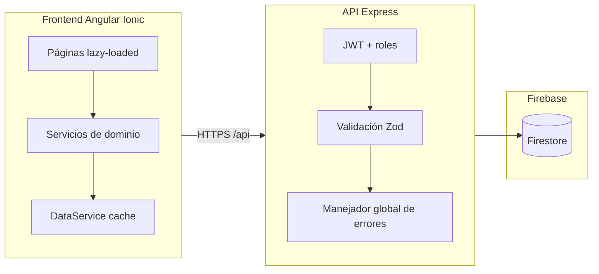

# Gestión Financiera IECA

Sistema web para la administración financiera de la **Iglesia Evangélica La Alborada (IECA)**. Permite registrar ingresos y gastos por ministerio, controlar aprobaciones, generar reportes, cerrar periodos contables y administrar usuarios con distintos niveles de acceso.

**Stack:** Angular 20 + Ionic 8 (frontend) · Node.js + Express 5 (API) · Firebase Firestore (datos).

### Plataforma de uso

| Ámbito | Estado |
|--------|--------|
| **Web (navegador)** | Uso previsto y despliegue actual: la aplicación se opera desde el **navegador en escritorio** (hosting estático + API). |
| **Móvil** | **Implementación futura** — no está previsto desplegar ni dar soporte oficial en teléfono en esta fase. |

A nivel técnico, el frontend **ya está orientado a móvil**: **Ionic 8**, estilos **responsive**, metaetiquetas en `index.html` para pantallas pequeñas y **Capacitor 8** en el proyecto (`capacitor.config.ts`). Eso facilitará una fase posterior (PWA, navegador móvil o app nativa), pero hoy no hay proyectos Android/iOS generados ni builds móviles en el flujo de release.

---

## Tabla de contenidos

1. [Características](#características-principales)
2. [Arquitectura](#arquitectura)
3. [Stack tecnológico](#stack-tecnológico)
4. [Estructura del proyecto](#estructura-del-proyecto)
5. [Requisitos previos](#requisitos-previos)
6. [Instalación](#instalación)
7. [Ejecución en desarrollo](#ejecución-en-desarrollo)
8. [Roles y permisos](#roles-y-permisos)
9. [API REST](#api-rest)
10. [Seguridad](#seguridad)
11. [Scripts](#scripts-disponibles)
12. [Build de producción](#build-de-producción)
13. [Pruebas automatizadas](#pruebas-automatizadas)
14. [Integración continua y release](#integración-continua-y-release)
15. [Despliegue](#despliegue)
16. [Solución de problemas](#solución-de-problemas)
17. [Licencia](#licencia)

---

## Características principales

| Módulo | Funcionalidad |
|--------|----------------|
| **Dashboard** | KPIs (balance, ingresos, gastos, tendencias), gráficos de 6 meses, distribución por ministerio, últimos movimientos |
| **Ingresos / Gastos** | CRUD, comprobantes (imagen/PDF), filtros, aprobación/rechazo, alcance por ministerio para líderes |
| **Ministerios** | Departamentos con líder y co-líder (solo administrador) |
| **Usuarios** | Roles, contraseña temporal en alta, cambio obligatorio al primer acceso |
| **Reportes** | Filtros por periodo, ministerio y tipo; exportación Excel; desglose por cuenta; impresión |
| **Administración** | Cierre mensual, backup/restauración JSON, auditoría CSV, **alertas por email**, limpieza de datos |
| **Notificaciones** | Pendientes y eventos del sistema |
| **Auth** | Login JWT, recuperación por código de 6 dígitos, cambio de contraseña |

### Reglas de negocio clave

- Los **líderes** crean movimientos en estado `pendiente`; **contable** o **administrador** aprueban o rechazan.
- Solo movimientos **aprobados** cuentan en balance, gráficos y reportes consolidados.
- Los **periodos cerrados** bloquean altas, ediciones y borrados en ese mes.
- El **cierre mensual** marca movimientos del periodo y actualiza la configuración del sistema (por lotes de hasta 500 operaciones en Firestore).

---

## Arquitectura



| Capa | Responsabilidad |
|------|-----------------|
| **Páginas** (`src/app/pages/`) | UI Ionic; lógica de presentación delegada a utilidades compartidas |
| **Servicios** (`src/app/services/`) | Cache local, llamadas HTTP, agregación (`DataService`) |
| **Core** (`src/app/core/`) | Guards, interceptors, modelos, `AuthService`, `ApiService` |
| **API** (`server/src/`) | Autenticación, validación, reglas de negocio, Firestore Admin |
| **Utilidades** (`shared/utils/`, `server/src/utils/`) | Lógica pura reutilizable y testeable |

### Frontend: rutas y carga

| Tipo | Rutas |
|------|-------|
| Carga inmediata | `/login`, `/recuperar-password`, `/cambiar-password` |
| **Lazy** (`loadComponent`) | `/dashboard`, `/ministerios`, `/ingresos`, `/gastos`, `/reportes`, `/usuarios`, `/administracion` |

En desarrollo, las peticiones a `/api` se redirigen al backend con `src/proxy.conf.json`.

### Backend: piezas principales

| Archivo / carpeta | Rol |
|-------------------|-----|
| `createApp.ts` | Fábrica de la app Express (arranque y tests) |
| `index.ts` | Punto de entrada; escucha en `PORT` |
| `middleware/errorHandler.ts` | `asyncHandler` + respuestas JSON unificadas |
| `middleware/auth.ts` | JWT access/refresh, `requireRoles` |
| `utils/cierre-mensual.ts` | Cierre por lotes Firestore |
| `utils/periodo.util.ts` | Claves de periodo (lógica pura, testeable) |
| `config/firebase.memory.ts` | Firestore en memoria para tests (`IECA_USE_MEMORY_DB=true`) |

---

## Stack tecnológico

| Capa | Tecnología |
|------|------------|
| Frontend | Angular 20, Ionic 8, TypeScript, SCSS, Chart.js |
| Backend | Node.js 20+, **TypeScript**, Express 5, JWT, bcryptjs, Zod, Helmet |
| Base de datos | Firebase Firestore |
| Móvil (futuro) | Capacitor 8 + UI responsive; despliegue móvil no activo; base lista para una fase posterior |
| Exportación | xlsx, xlsx-js-style |
| CI/CD | GitHub Actions (lint, test, build, artefactos de release) |

---

## Estructura del proyecto

```
proyecto_ieca/
├── .github/workflows/
│   ├── ci.yml                   # Lint + tests + build (PR y push)
│   └── release.yml              # Artefactos de despliegue
├── docs/
│   └── DEPLOY.md                # Guía de despliegue (Firebase, Nginx, PaaS…)
├── src/                         # Frontend
│   ├── app/
│   │   ├── auth/                # Login, recuperar y cambiar contraseña
│   │   ├── components/          # Tabla, sidebar, notificaciones…
│   │   ├── core/                # Guards, interceptors, modelos, API, auth
│   │   ├── pages/               # Pantallas (varias con lógica en utils)
│   │   ├── services/            # ingresos, gastos, data, reportes…
│   │   ├── shared/utils/        # Utilidades compartidas (ver tabla abajo)
│   │   ├── testing/             # Helpers para specs de componentes
│   │   └── app.routes.ts        # Rutas con lazy loading
│   ├── environments/
│   │   ├── environment.ts       # Dev (apiUrl, useLocalFallback)
│   │   └── environment.prod.ts  # Producción
│   └── proxy.conf.json
├── server/                      # API REST
│   ├── src/
│   │   ├── config/              # env, firebase, firebase.memory
│   │   ├── middleware/          # auth, cors, helmet, rateLimit, validate, errorHandler
│   │   ├── types/               # Tipos TypeScript (auth, Firestore, Express)
│   │   ├── routes/              # auth, crud, notificaciones, admin
│   │   ├── schemas/             # Validación Zod
│   │   ├── utils/               # cierre, backup, ingresos, gastos, email…
│   │   ├── createApp.ts
│   │   └── index.ts
│   ├── dist/                    # Salida compilada (`npm run build`) — no versionar
│   ├── test/                    # Tests Node (auth, periodo, HTTP, cierre)
│   │   └── setup.js             # JWT + Firestore en memoria
│   ├── tsconfig.json            # Compilación TypeScript → dist/
│   ├── scripts/
│   │   └── seed-passwords.js
│   ├── .env.example
│   └── firebase-service-account.json   # Local — NO versionar
├── capacitor.config.ts
├── angular.json
├── karma.conf.js                # ChromeHeadless en CI (CI=true)
└── package.json
```

### Utilidades frontend (`src/app/shared/utils/`)

| Archivo | Uso |
|---------|-----|
| **Movimientos (ingresos/gastos)** | |
| `movimiento-filtros.util.ts` | Filtros de tabla (fecha, monto, búsqueda, pendientes) |
| `movimiento-fecha.util.ts` | Máscara DD/MM/AAAA y selector nativo |
| `movimiento-acciones.util.ts` | Acciones de tabla según rol |
| `movimiento-ministerio.util.ts` | Alcance por ministerio para líderes |
| `movimiento-validacion.util.ts` | Validación de formularios |
| `movimiento-estado.util.ts` | Estado pendiente/aprobado al guardar |
| `movimiento-comprobante.util.ts` | Visor de comprobantes y errores de guardado |
| `movimiento-page.icons.ts` | Iconos Ionicons en ingresos/gastos |
| `movimiento-query.util.ts` | Query `?pendientes=1` en rutas |
| **Reportes** | |
| `reportes-filtros.util.ts` | Filtros, periodos y totales |
| `reportes-page.icons.ts` | Iconos de la pantalla reportes |
| **Administración** | |
| `audit-fecha.util.ts` | Fechas de auditoría (desde/hasta) |
| `audit.util.ts` | Filas y exportación de auditoría |
| `administracion-page.icons.ts` | Iconos de administración |
| **Generales** | |
| `date.util.ts`, `date-picker.util.ts` | Formato y picker de fechas |
| `month.util.ts` | Claves y etiquetas de meses |
| `currency.util.ts` | Formato de moneda |
| `gasto.util.ts`, `ingreso.util.ts` | Estados y etiquetas |
| `liderazgo.util.ts` | Etiquetas de líder/co-líder |
| `comprobante-upload.util.ts`, `image-upload.util.ts` | Subida de archivos |
| `loading.util.ts`, `error-message.util.ts` | UX y errores HTTP |
| `excel-ieca.styles.ts` | Estilos de exportación Excel |
| `contabilidad-cuentas.constants.ts` | Cuentas contables en formularios ingreso/gasto |
| `reportes-cuenta.util.ts` | Etiqueta de cuenta en Reportes y Excel |

Constantes en páginas: `administracion-accesos.constants.ts` (accesos rápidos del panel admin).

### Colecciones Firestore

| Colección | Descripción |
|-----------|-------------|
| `usuarios` | Login, rol, `passwordHash`, `ministerioId` (líderes) |
| `ministerios` | Nombre, estado, líderes |
| `ingresos` | Movimientos de entrada, estado, comprobante |
| `gastos` | Movimientos de salida, categoría, estado |
| `notificaciones` | Alertas por usuario |
| `config` / doc `sistema` | Periodos cerrados, último cierre |
| `login_auditoria` | Intentos de login (éxito/fallo) |

---

## Requisitos previos

- [Node.js](https://nodejs.org/) **18 o superior** (recomendado **20 LTS**)
- [npm](https://www.npmjs.com/) **9 o superior**
- Proyecto en [Firebase](https://console.firebase.google.com/) con **Firestore** habilitado
- Archivo de credenciales Firebase Admin SDK

---

## Instalación

### 1. Clonar e instalar dependencias

```bash
git clone <url-del-repositorio>
cd proyecto_ieca

# Frontend (raíz)
npm install

# Backend
cd server
npm install
cd ..
```

> `node_modules/` (raíz y `server/node_modules/`) están en `.gitignore`. **No los subas a Git.**

Si `server/node_modules` ya apareció en el historial:

```bash
git rm -r --cached server/node_modules
```

### 2. Configurar Firebase

1. Firebase Console → **Configuración del proyecto** → **Cuentas de servicio**.
2. Genera una nueva clave privada (JSON).
3. Guárdala como:

```
server/firebase-service-account.json
```

### 3. Variables de entorno del servidor

```bash
# Linux / macOS
cp server/.env.example server/.env

# Windows (PowerShell)
Copy-Item server\.env.example server\.env
```

Edita `server/.env`:

```env
PORT=3000

# Obligatorio: mínimo 32 caracteres
# node -e "console.log(require('crypto').randomBytes(48).toString('hex'))"
JWT_SECRET=

# Tokens (opcional): access corto + refresh largo
# JWT_ACCESS_EXPIRES=15m
# JWT_REFRESH_EXPIRES=7d

# Producción: orígenes del frontend (separados por coma)
# CORS_ORIGINS=https://ieca-alborada.org,https://app.ieca-alborada.org

# SMTP (opcional — recuperación de contraseña por email)
# SMTP_HOST=smtp.gmail.com
# SMTP_PORT=587
# SMTP_USER=...
# SMTP_PASS=...

# Solo desarrollo: incluir código de reset en la respuesta JSON
# DEV_RESET_CODE_IN_RESPONSE=true
```

**El servidor no arranca** si falta `JWT_SECRET` o si usa una clave de la lista de ejemplos rechazadas.

En desarrollo, sin `CORS_ORIGINS` solo se permiten `http://localhost:4200` y `http://127.0.0.1:4200`.

### 4. Usuario inicial en Firestore

Crea al menos un documento en `usuarios`:

| Campo | Ejemplo | Notas |
|-------|---------|-------|
| `usuario` | `admin` | Login único |
| `email` | `admin@ieca.com` | |
| `rol` | `Administrador` | Valores exactos abajo |
| `estado` | `Activo` | |
| `ministerioId` | `1` | Solo para `Lider/CoLider` |

**Roles válidos** (texto exacto en Firestore):

- `Administrador`
- `Contable`
- `Lider/CoLider`

### 5. Contraseñas iniciales

```bash
cd server
npm run seed
cd ..
```

Asigna la contraseña temporal `123456` a todos los usuarios (`passwordHash`). Cámbiala desde la app tras el primer acceso.

---

## Ejecución en desarrollo

Abre **dos terminales**:

**Terminal 1 — API**

```bash
cd server
npm run dev
```

| URL | Descripción |
|-----|-------------|
| `http://localhost:3000/api` | Base del API |
| `http://localhost:3000/api/health` | Health check |

**Terminal 2 — Frontend**

```bash
npm start
```

| URL | Descripción |
|-----|-------------|
| `http://localhost:4200` | Aplicación |
| `/api/*` | Proxy → backend (ver `proxy.conf.json`) |

### Modo demo sin backend (solo desarrollo)

En `src/environments/environment.ts`:

```typescript
useLocalFallback: true
```

La app usa `localStorage` y credenciales en `auth-local.fallback.ts`. **No uses esto en producción** — el build de producción reemplaza el fallback por un stub vacío.

---

## Roles y permisos

| Rol | Rutas | Capacidades |
|-----|-------|-------------|
| **Administrador** | Todas | CRUD completo, cierre, backup, usuarios, ministerios |
| **Contable** | Dashboard, ingresos, gastos, reportes | Aprobar/rechazar; sin usuarios ni ministerios |
| **Líder/Co-líder** | Dashboard, ingresos, gastos, reportes | Solo su `ministerioId`; crea pendientes; no aprueba |

### Flujo de aprobación

1. **Líder** registra → `pendiente`.
2. **Contable** o **admin** → `PATCH …/aprobar` o `PATCH …/rechazar` (motivo opcional).
3. Solo **aprobados** en KPIs, gráficos y reportes.
4. **Periodo cerrado** → sin cambios en ese mes.

### Rutas del frontend

| Ruta | Acceso |
|------|--------|
| `/login`, `/recuperar-password` | Público |
| `/cambiar-password` | Autenticado (`mustChangePassword` obligatorio) |
| `/dashboard`, `/ingresos`, `/gastos`, `/reportes` | Según rol |
| `/ministerios`, `/usuarios`, `/administracion` | Solo administrador |

**Atajo:** `/ingresos?pendientes=1` o `/gastos?pendientes=1` filtra pendientes.

---

## API REST

**Desarrollo:** `http://localhost:3000/api`

**Producción:** configura `apiUrl` en `environment.prod.ts`.

Cabecera en rutas protegidas:

```http
Authorization: Bearer <token>
```

### Salud y autenticación

| Método | Ruta | Auth | Descripción |
|--------|------|------|-------------|
| GET | `/health` | No | `{ ok: true, service: "ieca-server" }` |
| POST | `/auth/login` | No | `{ token, refreshToken, user }` |
| POST | `/auth/refresh` | No | `{ token, refreshToken }` — renueva access token |
| POST | `/auth/logout` | No | 204 |
| POST | `/auth/forgot-password` | No | Código de 6 dígitos |
| POST | `/auth/reset-password` | No | Restablecer con código |
| POST | `/auth/change-password` | Sí | Cambio con contraseña actual |

### Ingresos y gastos

| Método | Ruta | Descripción |
|--------|------|-------------|
| GET | `/ingresos`, `/gastos` | Lista (líder: solo su ministerio) |
| GET | `/ingresos/:id`, `/gastos/:id` | Detalle |
| POST | `/ingresos`, `/gastos` | Crear |
| PUT | `/ingresos/:id`, `/gastos/:id` | Actualizar |
| DELETE | `/ingresos/:id`, `/gastos/:id` | Eliminar |
| PATCH | `…/:id/aprobar` | Aprobar (admin, contable) |
| PATCH | `…/:id/rechazar` | Rechazar — body: `{ motivo? }` |

### Ministerios y usuarios (solo administrador)

| Método | Ruta |
|--------|------|
| CRUD | `/ministerios`, `/ministerios/:id` |
| CRUD | `/usuarios`, `/usuarios/:id` |

### Notificaciones

| Método | Ruta |
|--------|------|
| GET | `/notificaciones` |
| POST | `/notificaciones` |
| PATCH | `/notificaciones/marcar-todas` |
| PATCH | `/notificaciones/marcar-por-ruta` |
| PATCH | `/notificaciones/marcar-por-tipo` |
| PATCH | `/notificaciones/:id/leida` |

### Administración (solo administrador)

| Método | Ruta | Descripción |
|--------|------|-------------|
| GET | `/admin/config` | Periodos cerrados, último cierre |
| GET | `/admin/backup` | Respaldo JSON |
| POST | `/admin/restore` | Restaurar respaldo |
| POST | `/admin/cierre` | Cierre mensual — body: `{ periodo? }` |
| DELETE | `/admin/datos` | Vaciar colecciones principales |
| GET | `/admin/login-auditoria` | Intentos de login fallidos |
| GET | `/admin/auditoria` | Auditoría CSV (query: fechas, tipo) |
| GET | `/admin/alertas/resumen` | Vista previa del resumen operativo |
| POST | `/admin/alertas/enviar` | Envía email a admin/contable — body: `{ force?: boolean }` |

---

### Cuenta contable en movimientos

Al registrar un **ingreso** o **gasto**, eliges la **cuenta contable** en el formulario (ej. `4102 — Diezmos y ofrendas`). En **Reportes** la tabla y el Excel muestran la columna **Cuenta**. Las opciones del menú están en `src/app/shared/constants/contabilidad-cuentas.constants.ts`.

> **Exportación CSV contable (kardex):** pendiente para una versión futura. Por ahora solo **Exportar a Excel** en Reportes.

---

## Alertas por correo

El servidor puede enviar un **resumen operativo** a usuarios **Administrador** y **Contable** con email configurado:

1. **Pendientes antiguos:** ingresos/gastos en estado `pendiente` con más de **48 h** desde `auditCreadoEn` (configurable).
2. **Cierre del mes:** en los últimos **5 días** del mes, si el periodo actual no está cerrado.

| Mecanismo | Uso |
|-----------|-----|
| **Panel Admin** | Botón «Enviar resumen ahora» |
| **CLI** | `cd server && npm run alertas` (o `npm run alertas:force`) |
| **Cron en API** | `ALERTAS_CRON_ENABLED=true` en `.env` |
| **GitHub Actions** | Workflow [`.github/workflows/alertas-email.yml`](.github/workflows/alertas-email.yml) diario |

Variables en `server/.env`:

```env
ALERTAS_EMAIL_ENABLED=true
ALERTAS_HORAS_PENDIENTE=48
ALERTAS_DIAS_CIERRE=5
# SMTP_* (mismas que recuperación de contraseña)
```

Sin SMTP en desarrollo, el resumen se imprime en la consola del servidor. Máximo **un envío automático por día** (usa `force: true` para repetir).

**Secrets en GitHub (workflow de alertas):** `JWT_SECRET`, `FIREBASE_SERVICE_ACCOUNT_JSON`, `SMTP_HOST`, `SMTP_USER`, `SMTP_PASS`, etc.

---

## Seguridad

| Medida | Detalle |
|--------|---------|
| Contraseñas | **bcrypt** en Firestore |
| JWT | Access **15 min** (`JWT_ACCESS_EXPIRES`) + refresh **7 días** (`JWT_REFRESH_EXPIRES`); claims access: `sub`, `rol`, `ministerioId`, `type: access` |
| `JWT_SECRET` | Obligatorio, ≥ 32 caracteres; rechaza claves débiles |
| CORS | Orígenes explícitos (`CORS_ORIGINS`) |
| Helmet | Cabeceras de seguridad HTTP |
| Rate limiting | Login: 5 / 15 min por IP; API: 200 / 15 min (prod), 5000 / 15 min (dev); `RATE_LIMIT_API_MAX` |
| Validación | **Zod** en auth, CRUD, notificaciones, admin |
| Recuperación | Código 6 dígitos (SMTP o consola en dev) |
| Auditoría login | IP, usuario, motivo en fallos |
| Errores API | Manejador global — respuestas `{ message }`; **500 sin detalle** en producción |
| Arranque prod | Rechaza `CORS_ORIGINS` vacío, memoria DB, reset code en JSON, Firebase ausente |
| Cierre graceful | SIGTERM / SIGINT cierran conexiones antes de salir |
| Verificación | `npm run verify:prod` + `prestart` antes de `npm start` |
| PM2 | `server/ecosystem.config.cjs` incluido para VPS |
| Demo offline | `auth-local.fallback.ts` excluido del build de producción |
| Secretos | `.env`, `firebase-service-account.json` en `.gitignore` |

**Antes de producción:** sigue el checklist en **[docs/DEPLOY.md](docs/DEPLOY.md)** — `NODE_ENV=production`, `JWT_SECRET` único, `CORS_ORIGINS` HTTPS, `npm run build`, `npm run verify:prod`, contraseñas del seed cambiadas, SMTP si aplica.

---

## Scripts disponibles

### Frontend (raíz del proyecto)

| Comando | Descripción |
|---------|-------------|
| `npm start` | Servidor de desarrollo (`:4200`) |
| `npm run build` | Build de producción → `www/` |
| `npm run build:ci` | Igual que build producción (usado en CI) |
| `npm test` | Tests Karma/Jasmine (watch) |
| `npm run test:ci` | Tests headless (como en GitHub Actions) |
| `npm run lint` | ESLint (Angular) |

### Backend (`server/`)

| Comando | Descripción |
|---------|-------------|
| `npm run build` | Compila TypeScript → `dist/` |
| `npm run verify:prod` | Checklist automático pre-producción (requiere `dist/` y `NODE_ENV=production`) |
| `npm start` | API en producción (`prestart` verifica `dist/` automáticamente) |
| `npm run dev` | API con recarga (`tsx watch src/index.ts`) |
| `npm run seed` | Contraseña `123456` en todos los usuarios |
| `npm run alertas` | Resumen operativo por email (si hay alertas) |
| `npm run alertas:force` | Igual, ignorando límite de un envío/día |
| `npm run typecheck` | Comprobación TypeScript sin emitir (`tsc --noEmit`) |
| `npm test` | 37+ tests (unitarios + HTTP en memoria) |
| `npm run test:integration` | Solo tests HTTP (Supertest) |

---

## Build de producción

### Frontend

```bash
npm run build
# o
npm run build:ci
```

Salida en `www/`. Configura `src/environments/environment.prod.ts`:

```typescript
export const environment = {
  production: true,
  apiUrl: 'https://api.tu-dominio.org/api',
  useLocalFallback: false
};
```

### Backend

En el servidor de producción:

- `server/.env` configurado
- `server/firebase-service-account.json` presente
- `npm run build` → carpeta `dist/`
- `NODE_ENV=production` recomendado
- Comando: `npm start` (desde `server/`, ejecuta `dist/index.js`)

---

## Pruebas automatizadas

### Resumen

| Ámbito | Cantidad | Herramienta |
|--------|----------|-------------|
| Frontend | **35** casos (`17` archivos `.spec.ts`) | Karma + Jasmine + ChromeHeadless |
| Backend | **42** casos (`8` archivos `.test.js`) | Node.js test runner + Supertest |
| **Total** | **77** | Replicado en GitHub Actions |

### Frontend

```bash
# Desarrollo (watch)
npm test

# Modo CI (headless, single run)
npm run test:ci
```

Con `CI=true`, `karma.conf.js` usa `ChromeHeadless` y una sola ejecución.

| Archivo | Qué valida |
|---------|------------|
| `data.service.spec.ts` | KPIs solo aprobados, ministerio, pendientes, gráfico 6 meses |
| `movimiento-filtros.util.spec.ts` | Filtros ingresos/gastos |
| `movimiento-validacion.util.spec.ts` | Validación de formularios |
| `reportes-filtros.util.spec.ts` | Filtros y periodos en reportes |
| `*.component.spec.ts`, `app.component.spec.ts` | Smoke y creación de componentes (12 archivos) |

### Backend

```bash
cd server
npm test
```

Usa `test/setup.js`: JWT de prueba + `IECA_USE_MEMORY_DB=true` (sin Firebase real).

| Archivo | Qué valida |
|---------|------------|
| `auth.test.js` | Schemas Zod, tokens access/refresh, `requireRoles` |
| `periodo.test.js` | Claves de periodo, `entityBloqueadoPorCierre` |
| `cierre-mensual.test.js` | Lotes de cierre (chunks de 500) |
| `http.integration.test.js` | Health, login, refresh, cierre + 409 duplicado |
| `email-templates.test.js` | Plantillas HTML de correo |
| `resumen-operativo.test.js` | Alertas operativas (pendientes, cierre) |
| `env.production.test.js` | Validaciones de config con `NODE_ENV=production` |

### Replicar pipeline completo en local

```bash
# Frontend
npm run lint
npm run test:ci
npm run build:ci

# Backend (PowerShell)
cd server
$env:JWT_SECRET="unit-test-jwt-secret-min-32-characters-long-for-ci!!"
npm run typecheck
npm test
```

---

## Integración continua y release

### CI — cada push y PR

Workflow: [`.github/workflows/ci.yml`](.github/workflows/ci.yml)

**Ramas:** `main`, `master`, `develop`

| Job | Pasos |
|-----|--------|
| **Frontend** | `npm ci` → `lint` → `test:ci` → `build:ci` |
| **Backend** | `npm ci` → `typecheck` → `build` → `npm test` (memoria + JWT de prueba) |

### Release — artefactos de despliegue

Workflow: [`.github/workflows/release.yml`](.github/workflows/release.yml)

| Disparador | Comportamiento |
|------------|----------------|
| **CI completado** en `main` / `master` | Se ejecuta solo si CI terminó en **success** |
| `workflow_dispatch` | Build manual desde Actions (sin esperar CI) |
| Tag `v*` | Build al publicar versión |

**Artefactos generados:**

| Artefacto | Contenido |
|-----------|-----------|
| `ieca-frontend-www` | Carpeta `www/` (sitio estático) |
| `ieca-server` | API compilada (`dist/`) con `node_modules` de producción |

Descarga: GitHub → **Actions** → **Release build** → **Artifacts**.

---

## Despliegue

Guía paso a paso: **[docs/DEPLOY.md](docs/DEPLOY.md)**

Incluye:

- Checklist pre-producción
- Firebase Hosting, Nginx, Railway/Render, PM2
- Verificación post-despliegue (`/api/health`, login)
- Actualización de versiones

Resumen rápido:

1. Descarga artefactos del workflow **Release build** (o ejecuta `npm run build:ci` y empaqueta `server/`).
2. Configura `JWT_SECRET`, `CORS_ORIGINS` y `firebase-service-account.json` en el host del API.
3. Sirve `www/` en tu hosting estático o proxy.
4. Apunta `environment.prod.ts` → `apiUrl` al dominio del API.

---

## Solución de problemas

| Problema | Causa probable | Solución |
|----------|----------------|----------|
| `[FALTA] firebase-service-account.json` | Sin credenciales | Coloca el JSON en `server/` |
| `[FALTA] JWT_SECRET` | `.env` incompleto | Copia `.env.example`; genera secreto ≥ 32 chars |
| `[SEGURIDAD] JWT_SECRET…` | Clave débil | `node -e "console.log(require('crypto').randomBytes(48).toString('hex'))"` |
| `Usuario sin contraseña configurada` | Sin `passwordHash` | `cd server && npm run seed` |
| Error **401** en todo el API | Token expirado o JWT distinto | Cierra sesión; unifica `JWT_SECRET` en todos los entornos |
| Frontend no conecta al API | Backend apagado | `npm run dev` en `server/` + `npm start` en raíz |
| **CORS** en producción | Origen no permitido | Añade dominio del frontend en `CORS_ORIGINS` |
| `server/node_modules` en git status | Carpeta ignorada ahora | `git rm -r --cached server/node_modules` |
| Rutas duplicadas `src\app` vs `src/app` (Windows) | Separadores mezclados al añadir archivos | Usa rutas con `/`; el repo incluye `.gitattributes` con `eol=lf` |
| Comprobante no guarda | Archivo muy grande | Reduce tamaño; error `STORAGE_QUOTA` en modo local |
| Periodo cerrado al guardar | Cierre ejecutado | No modificar ese mes; admin puede restaurar backup |
| Pantalla en blanco tras deploy | SPA sin rewrite | Configura fallback a `index.html` |
| Avisos Ionicons en tests | Limitación Karma headless | No afecta resultado; tests pasan |
| Release cancelado — CI no exitoso | CI falló en el mismo push | Corrige el workflow **CI** primero; el release se relanzará solo al completar CI en verde |
| Release manual | CI aún en curso | Usa **workflow_dispatch** o espera a que CI termine |

---

## Licencia

Proyecto privado — uso académico e institucional para **IECA** (Iglesia Evangélica La Alborada).
