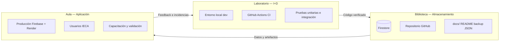
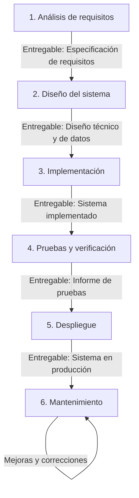
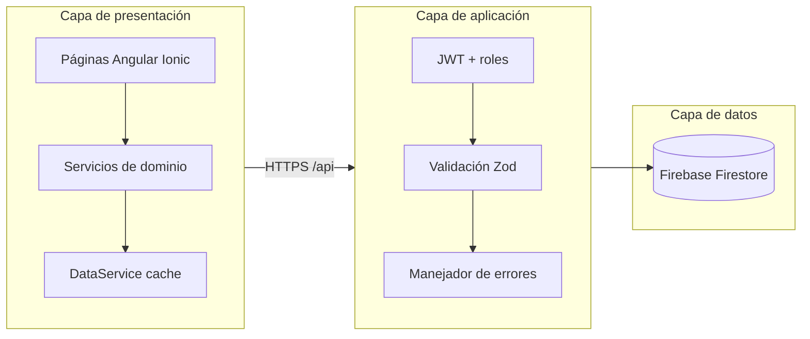
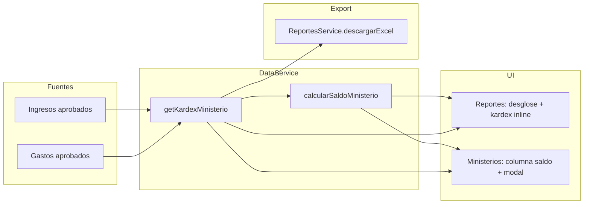
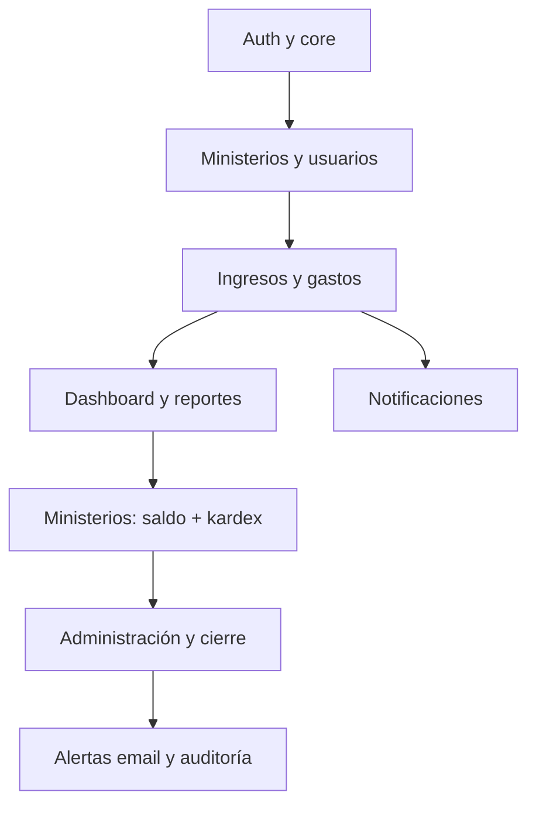
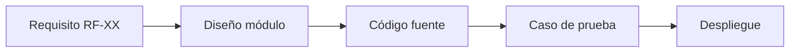
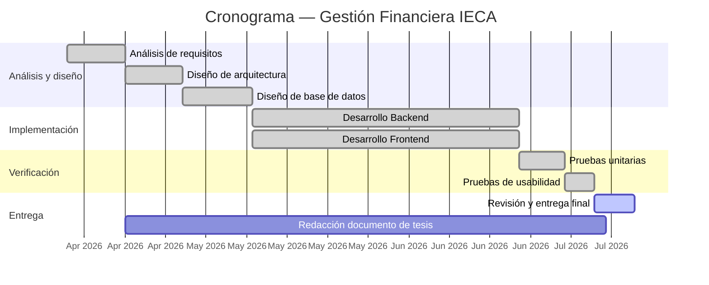

# Metodología del proyecto — Gestión Financiera IECA

Documento de referencia sobre la metodología de desarrollo del sistema web de administración financiera de la **Iglesia Evangélica La Alborada (IECA)**.

---

## 1. Introducción

### 1.1 Contexto

El proyecto consiste en un **sistema web de gestión financiera** para uso interno de IECA. Permite registrar ingresos y gastos por ministerio, controlar aprobaciones, generar reportes, cerrar periodos contables y administrar usuarios con distintos niveles de acceso.

| Aspecto | Descripción |
|---------|-------------|
| **Producto** | Panel administrativo web (navegador de escritorio). |
| **Usuarios finales** | Administrador, contable y colaboradores de ministerio. |
| **Stack tecnológico** | Angular 20 + Ionic 8 (frontend) · Node.js + Express 5 (API) · Firebase Firestore (datos). |
| **Alcance** | Aplicación web institucional (escritorio principal); vista estrecha en navegador soportada; app móvil nativa fuera del alcance. |
| **Equipo** | Desarrollo académico e institucional (equipo reducido). |

### 1.2 Metodología adoptada: **Modelo en cascada (Waterfall)**

Se adopta el **modelo en cascada** como metodología principal del proyecto. Este enfoque organiza el desarrollo en **fases secuenciales**: cada fase debe completarse y validarse antes de iniciar la siguiente, con entregables documentados al cierre de cada etapa.

**Características del modelo aplicado:**

- Requisitos definidos y documentados al inicio del proyecto.
- Diseño del sistema antes de la codificación.
- Implementación completa según especificaciones de diseño.
- Pruebas sistemáticas sobre el producto construido.
- Despliegue una vez superadas las pruebas.
- Mantenimiento posterior a la puesta en producción.

**Justificación de la elección:**

1. Las **reglas de negocio contables** (aprobaciones, periodos cerrados, roles) son estables y deben quedar bien definidas desde el análisis.
2. La **arquitectura en capas** (frontend, API, base de datos) se puede diseñar de forma completa antes de implementar.
3. El proyecto académico requiere **trazabilidad clara** entre requisitos, diseño, código y pruebas.
4. El alcance funcional principal (CRUD de movimientos, reportes, administración, auth) está **delimitado** para la entrega del sistema.

### 1.3 Supuestos y restricciones

#### Supuestos

| ID | Supuesto |
|----|----------|
| S-01 | IECA dispone de personal administrativo y contable dispuesto a validar requisitos y probar el sistema. |
| S-02 | Los ministerios operan con un catálogo de cuentas contables predefinido y estable. |
| S-03 | Los usuarios acceden al sistema desde **navegador de escritorio** con conexión a Internet. |
| S-04 | Firebase (Firestore + Hosting) y Render permanecen disponibles como servicios en la nube. |
| S-05 | La regla de **aportación iglesia (33 %)** sobre ingresos de talento (`4105`) es la política vigente de IECA. |
| S-06 | El desarrollo se realiza en un contexto académico con un equipo reducido (desarrollador + stakeholders IECA). |

#### Restricciones

| ID | Restricción |
|----|-------------|
| R-01 | **Alcance funcional:** no se incluye app móvil nativa ni integración con software contable externo. |
| R-02 | **Roles fijos:** solo Administrador, Contable y Colaborador; no hay permisos granulares personalizables. |
| R-03 | **Presupuesto:** uso de servicios con capa gratuita o de bajo costo (Firebase Spark/Blaze, Render free tier). |
| R-04 | **Seguridad:** contraseñas almacenadas con bcrypt; JWT con expiración; sin SSO institucional. |
| R-05 | **Periodos cerrados:** una vez cerrado un mes, no se permiten altas, ediciones ni borrados en ese periodo. |
| R-06 | **Tiempo:** el cronograma académico delimita las fechas de entrega de cada fase (ver sección 14). |

### 1.4 Estudio de viabilidad

#### Viabilidad económica

| Concepto | Detalle |
|----------|---------|
| **Inversión en licencias** | Cero: stack open source (Angular, Node.js, Express, TypeScript). |
| **Infraestructura en la nube** | Firebase Hosting (frontend estático) + Render (API Node.js) + Firestore. Plan gratuito o de bajo costo según uso. |
| **Herramientas de desarrollo** | VS Code/Cursor, Git, GitHub (repositorio privado) — sin costo. |
| **Mantenimiento estimado** | Backups manuales desde el panel admin; monitoreo con health check y CI automatizado. |
| **Conclusión** | El proyecto es **económicamente viable** para una organización sin presupuesto de TI dedicado. |

#### Viabilidad de infraestructura tecnológica

| Componente | Tecnología | Justificación |
|------------|------------|---------------|
| Frontend | Angular 20 + Ionic 8 | Framework maduro, componentes reutilizables, lazy loading. |
| Backend | Node.js + Express 5 + TypeScript | API REST ligera, tipado estático, ecosistema npm. |
| Base de datos | Firebase Firestore | NoSQL escalable, tiempo real, SDK Admin para la API. |
| Autenticación | JWT (access + refresh) | Stateless, compatible con SPA y despliegue en Render. |
| CI/CD | GitHub Actions | Verificación automática en cada push/PR. |
| Hosting | Firebase Hosting + Render | Despliegue continuo, HTTPS incluido, dominio personalizable. |
| **Conclusión** | La infraestructura elegida es **técnicamente viable**, documentada y desplegada en producción. |

### 1.5 Recurso humano y formas de aprendizaje

| Rol | Responsabilidad | Participación |
|-----|-----------------|---------------|
| **Desarrollador (autor)** | Análisis, diseño, codificación, pruebas, despliegue, documentación | Todas las fases |
| **Administrador IECA** | Validación de requisitos, pruebas de aprobación/cierre, feedback operativo | F1, F4, F5, F6 |
| **Contable IECA** | Validación de reportes, kardex, exportación Excel | F1, F4, F5 |
| **Colaboradores de ministerio** | Validación de registro de movimientos | F1, F4 |

**Formas de aprendizaje aplicadas durante el proyecto:**

1. **Aprendizaje autodirigido:** documentación oficial de Angular, Firebase y Express; resolución de incidencias en desarrollo.
2. **Aprendizaje experiencial:** iteración sobre el dominio contable de IECA (aportación 33 %, kardex, cierre mensual).
3. **Validación con el usuario:** entrevistas y pruebas manuales con administración y contabilidad para ajustar flujos.
4. **Aprendizaje por prueba y error controlada:** pruebas automatizadas (95 casos) como red de seguridad ante regresiones.

### 1.6 Los tres ambientes fundamentales

La metodología del proyecto integra los tres ambientes que soportan los procesos educativos y tecnológicos, adaptados al contexto de desarrollo de software:

| Ambiente | Función en el proyecto | Herramientas / ubicación |
|----------|------------------------|--------------------------|
| **Laboratorio (investigación y desarrollo)** | Codificación, experimentación con tecnologías, pruebas automatizadas y revisión de código | `npm start`, `server/npm run dev`, Karma, Node test runner, ESLint, proxy local `/api` |
| **Biblioteca (almacenamiento)** | Persistencia de datos, respaldos, documentación técnica y control de versiones | Firestore (`usuarios`, `ingresos`, `gastos`, …), backup/restauración JSON, `docs/`, GitHub |
| **Aula (aplicación)** | Uso real del sistema por los actores de IECA; capacitación y validación operativa | Firebase Hosting (frontend), Render (API), acceso por rol en navegador de escritorio |

**Orden de intervención:** Laboratorio → Biblioteca → Aula. Todo cambio se desarrolla y prueba en el laboratorio, se persiste y documenta en la biblioteca, y solo entonces se despliega al aula (producción) tras superar el plan de calidad.

### 1.7 Plan de calidad (resumen)

| Actividad de calidad | Momento | Responsable | Criterio de aceptación |
|----------------------|---------|-------------|------------------------|
| Revisión de requisitos | Fase 1 | Admin/contable IECA | Requisitos firmados / validados |
| Revisión de diseño | Fase 2 | Desarrollador | Coherencia con requisitos |
| Estándares de código | Fase 3 | Desarrollador | ESLint sin errores; TypeScript estricto |
| Pruebas unitarias frontend | Fase 4 | Desarrollador + CI | 46 casos en verde |
| Pruebas backend | Fase 4 | Desarrollador + CI | 49 casos (48 lógica + 1 SMTP opcional) |
| Pruebas manuales por rol | Fase 4 | Stakeholders IECA | Flujos críticos verificados |
| Checklist de despliegue | Fase 5 | Desarrollador | `verify:prod` + health check OK |
| Mantenimiento correctivo | Fase 6 | Desarrollador | CI en verde tras cada corrección |

Detalle de casos de prueba y resultados en la **sección 6**.

---

## 2. Modelo en cascada — Visión general

| Fase | Objetivo | Criterio de cierre |
|------|----------|-------------------|
| 1. Análisis | Definir qué debe hacer el sistema | Requisitos validados con el stakeholder |
| 2. Diseño | Definir cómo se construirá | Arquitectura y modelos de datos aprobados |
| 3. Implementación | Construir el sistema | Código completo según diseño |
| 4. Pruebas | Verificar calidad y cumplimiento | Casos de prueba superados |
| 5. Despliegue | Poner el sistema en operación | Entorno productivo funcional |
| 6. Mantenimiento | Sostener y evolucionar el sistema | Incidencias y mejoras gestionadas |

---

## 3. Fase 1 — Análisis de requisitos

### 3.1 Objetivo

Recopilar, analizar y documentar las necesidades de IECA para transformarlas en requisitos funcionales y no funcionales verificables.

### 3.2 Actividades

1. Entrevistas y consultas con administración, contabilidad y colaboradores de ministerio.
2. Identificación de actores y casos de uso del sistema.
3. Definición de reglas de negocio contables.
4. Delimitación del alcance (incluido / excluido).
5. Redacción de la especificación de requisitos.

### 3.3 Actores del sistema

| Actor | Descripción |
|-------|-------------|
| **Administrador** | Acceso total: usuarios, ministerios, **aprobación/rechazo de movimientos**, cierre, backup, auditoría. |
| **Contable** | Consulta ingresos/gastos y reportes; recibe alertas por correo; **no** aprueba movimientos ni gestiona usuarios/ministerios. |
| **Colaborador** | Registra ingresos/gastos de su ministerio (si tiene `ministerioId`) en estado pendiente. |

### 3.3.1 Casos de uso (18 en 4 módulos)

La especificación validada agrupa **18 casos de uso** en **4 módulos**. Tabla completa en **[CASOS-DE-USO.md](./CASOS-DE-USO.md)**.

### 3.4 Requisitos funcionales principales

| ID | Requisito | Descripción |
|----|-----------|-------------|
| RF-01 | Autenticación | Login con JWT, recuperación de contraseña, cambio obligatorio en primer acceso. |
| RF-02 | Gestión de ingresos | CRUD, comprobantes, filtros, estados pendiente/aprobado/rechazado; aprobación/rechazo **solo administrador**. |
| RF-03 | Gestión de gastos | CRUD, categorías, comprobantes; aprobación/rechazo **solo administrador**. |
| RF-04 | Flujo de aprobación | Colaborador crea pendiente; **solo el administrador** aprueba o rechaza. |
| RF-05 | Ministerios | CRUD de departamentos; colaboradores asignados vía usuarios con `ministerioId` (solo admin). |
| RF-06 | Usuarios | CRUD con roles, contraseña temporal en alta. |
| RF-07 | Dashboard | KPIs, gráficos y últimos movimientos (solo aprobados). |
| RF-08 | Reportes | Filtros por período, ministerio y tipo; resumen del período; desglose por ministerio (saldo disponible histórico, **aportación período/acum.** para admin) y por cuenta; kardex por ministerio; exportación Excel enriquecida (agregación client-side). |
| RF-09 | Cierre mensual | Bloqueo de periodos; movimientos del mes marcados como cerrados. |
| RF-10 | Administración | Backup/restauración JSON, auditoría CSV, alertas por email, **resumen de aportación iglesia por ministerio**. |
| RF-11 | Notificaciones | Alertas de pendientes y eventos del sistema por usuario. |
| RF-12 | Aportación iglesia | Al aprobar ingreso de **talento** (`4105`) con ministerio: **33%** automático a `General`; ministerio retiene **67%**; movimiento automático no editable. |
| RF-13 | Carga inicial (bootstrap) | `GET /api/bootstrap` agrega datos por rol en una petición; caché servidor y cliente para reducir latencia. |
| RF-14 | Unicidad | Nombres de ministerio y emails sin duplicados (tildes/mayúsculas; equivalentes «ministerio de…»). |
| RF-15 | Fechas de movimiento | Fecha ≤ hoy; periodos cerrados bloquean altas y cambios. |

### 3.5 Reglas de negocio clave

- Solo los movimientos en estado **aprobado** cuentan en balance, gráficos, reportes consolidados, **kardex** y **saldo disponible**.
- Los **colaboradores** registran en `pendiente`; **solo el administrador** aprueba o rechaza (`PATCH …/aprobar`, `PATCH …/rechazar`).
- El **contable** consulta movimientos y reportes y recibe alertas por correo, pero **no** ejecuta aprobaciones.
- Los totales **del período** en Reportes respetan el filtro de mes, ministerio y tipo; el **saldo disponible** y el **kardex** son **históricos** (todos los aprobados del ministerio, sin filtro de mes).
- Los **periodos cerrados** impiden altas, ediciones y borrados en ese mes.
- La **fecha del movimiento** no puede ser futura; meses abiertos del pasado se permiten hasta el cierre.
- Los **colaboradores** solo ven y operan sobre su `ministerioId` (cuando está asignado).
- El rol en Firestore es **`Colaborador`**; el valor legacy `Lider/CoLider` sigue aceptándose en login y API.
- El **cierre mensual** procesa movimientos por lotes (hasta 500 operaciones por lote en Firestore).
- El **kardex** es una vista derivada calculada en el cliente: ledger cronológico de ingresos/gastos aprobados por ministerio; no existe colección ni endpoint dedicado.
- La **aportación iglesia (33%)** aplica solo a ingresos de cuenta **4105** (talento) con ministerio asignado; genera un ingreso en `General` al aprobar; no crea gastos automáticos; al borrar el origen se elimina el ingreso vinculado.

### 3.6 Requisitos no funcionales

| ID | Requisito | Criterio |
|----|-----------|----------|
| RNF-01 | Seguridad | Contraseñas con bcrypt; JWT access/refresh; Helmet; rate limiting. |
| RNF-02 | Validación | Esquemas Zod en API; guards e interceptors en frontend. |
| RNF-03 | Usabilidad | Interfaz de escritorio en navegador; sidebar fijo; toasts consistentes; **vista estrecha** (≤768px) con menú ☰ y layout adaptable sin afectar escritorio. |
| RNF-04 | Disponibilidad | API en Render (plan **Starter**, siempre activo); frontend en Firebase Hosting. |
| RNF-05 | Mantenibilidad | Código modular por capas; utilidades puras testeables. |
| RNF-06 | Trazabilidad | Auditoría de login y movimientos; exportación CSV. |

### 3.7 Entregable de la fase

**Especificación de requisitos del sistema** — documento con actores, casos de uso, requisitos funcionales/no funcionales, reglas de negocio y alcance del proyecto.

**Criterio de cierre de la fase:** validación de requisitos por el administrador o contable de IECA (como stakeholders) antes de pasar a diseño — independiente del flujo operativo de aprobación de movimientos (solo administrador).

---

## 4. Fase 2 — Diseño del sistema

### 4.1 Objetivo

Definir la arquitectura técnica, el modelo de datos, la estructura de la API y la organización del frontend conforme a los requisitos aprobados.

### 4.2 Actividades

1. Diseño de arquitectura en capas (cliente, API, persistencia).
2. Modelado de colecciones Firestore y relaciones.
3. Diseño de endpoints REST y contratos de datos.
4. Diseño de pantallas y flujos de navegación por rol.
5. Diseño de seguridad (JWT, roles, CORS, validación).
6. Plan de pruebas (unitarias, integración, manuales).

### 4.3 Arquitectura general

### 4.4 Diseño de capas

| Capa | Ubicación | Responsabilidad |
|------|-----------|-----------------|
| **Presentación** | `src/app/pages/`, `components/` | UI Ionic; componente `tabla-general` reutilizable; lógica en utilidades |
| **Servicios** | `src/app/services/` | Cache, HTTP, agregación (`DataService`), reportes y Excel (`ReportesService`) |
| **Core** | `src/app/core/` | Guards, interceptors, modelos (`KardexLinea`, `Reporte`, …), auth, `CierreService` |
| **Theme** | `src/theme/` | Layouts por pantalla (`_reportes-layout`, `_tabla-general`, `_mobile-narrow`, …) |
| **API** | `server/src/routes/`, `utils/` | Reglas de negocio, validación, Firestore Admin |
| **Utilidades** | `shared/utils/`, `server/src/utils/` | Lógica pura reutilizable y testeable |

### 4.5 Modelo de datos (Firestore)

| Colección | Campos principales |
|-----------|-------------------|
| `usuarios` | `usuario`, `email`, `rol`, `passwordHash`, `ministerioId`, `estado` |
| `ministerios` | `nombre`, `estado` (colaboradores derivados de `usuarios.ministerioId`) |
| `ingresos` | Monto, fecha, ministerio, cuenta, estado, comprobante, auditoría; campos de aportación (`esAportacionIglesia`, `aportacionGenerada`, `ingresoIglesiaId`, `montoAportacionIglesia`, `montoNetoMinisterio`) |
| `gastos` | Monto, fecha, ministerio, categoría, estado, comprobante, auditoría |
| `notificaciones` | Usuario destino, tipo, ruta, leída |
| `config/sistema` | Periodos cerrados, último cierre |
| `login_auditoria` | Intentos de login (éxito/fallo) |

**Vistas derivadas (no persistidas en Firestore):**

| Concepto | Origen | Uso |
|----------|--------|-----|
| **Kardex de ministerio** | Ingresos/gastos aprobados por `ministerioId` | Ledger cronológico con saldo acumulado; modal en Ministerios e inline en Reportes |
| **Saldo disponible** | Última línea del kardex | Columna en desglose de Reportes y tabla de Ministerios |
| **Aportación por ministerio** | Ingresos automáticos `esAportacionIglesia` + cálculo 33% en talento | Tabla en Administración; columnas en Reportes (admin) |

### 4.6 Diseño de módulos funcionales

| Módulo | Rutas frontend | Endpoints API / origen de datos |
|--------|----------------|--------------------------------|
| Auth | `/login`, `/recuperar-password`, `/cambiar-password` | `/auth/*`; `api-wake` en producción |
| Carga inicial | (tras login) | `GET /api/bootstrap` — datos agregados por rol |
| Dashboard | `/dashboard` | `DataService.bootstrapRemote` + agregación |
| Ingresos / Gastos | `/ingresos`, `/gastos` | CRUD + `/aprobar`, `/rechazar` (**solo administrador**) |
| Reportes | `/reportes` | Agregación **client-side** (`DataService`, `ReportesService`); Excel local con `xlsx-js-style` |
| Usuarios / Ministerios | `/usuarios`, `/ministerios` | CRUD (solo admin); unicidad de nombres/emails; kardex en cliente |
| Cierres | (todas las pantallas) | `GET /api/cierres/estado` vía `CierreService` |
| Administración | `/administracion` | `/admin/*` |

### 4.6.1 Flujo del kardex (vista derivada)

### 4.7 Diseño de seguridad

- **Autenticación:** JWT access (8 h) + refresh (7 días); tokens en `sessionStorage`.
- **Autorización:** `requireRoles` en API; `authGuard` y `roleGuard` en rutas.
- **Validación de entrada:** Zod en auth, CRUD, notificaciones y admin.
- **Protección HTTP:** Helmet, CORS explícito, rate limiting en login y API.

### 4.8 Entregable de la fase

**Documento de diseño del sistema** — diagramas de arquitectura, modelo de datos, catálogo de endpoints, mapa de pantallas y matriz rol–permiso.

**Criterio de aprobación:** coherencia con la especificación de requisitos (Fase 1) y revisión técnica del diseño.

---

## 5. Fase 3 — Implementación (codificación)

### 5.1 Objetivo

Construir el sistema completo según el diseño aprobado, respetando la arquitectura definida y las reglas de negocio documentadas.

### 5.2 Actividades

1. Configuración del entorno de desarrollo (Node.js, Firebase, variables de entorno).
2. Implementación del backend (Express, rutas, middleware, utilidades).
3. Implementación del frontend (páginas, servicios, componentes compartidos).
4. Integración frontend–API (proxy en desarrollo, `apiUrl` en producción).
5. Implementación de exportación Excel (incl. kardex), kardex client-side, notificaciones y alertas por correo.
6. Control de versiones con Git y revisión de código.

### 5.3 Orden de implementación por módulo

Siguiendo el diseño, la codificación se organizó por módulos dependientes:

| Orden | Módulo | Componentes principales |
|-------|--------|-------------------------|
| 1 | Auth | Login, JWT, guards, recuperación de contraseña |
| 2 | Ministerios / Usuarios | CRUD admin, colaboradores por `ministerioId`, unicidad, columna saldo disponible, modal kardex |
| 3 | Ingresos / Gastos | Formularios, tabla, aprobación/rechazo (admin), comprobantes |
| 4 | Dashboard | KPIs, Chart.js, tendencias, movimientos recientes |
| 5 | Reportes | Filtros multi-dimensionales, distinción período/histórico, desglose por ministerio y cuenta, kardex inline, Excel enriquecido |
| 6 | Administración | Resumen ejecutivo, accesos rápidos, cierre mensual, backup, auditoría |
| 7 | Notificaciones / Alertas | Campana UI, emails operativos |

### 5.4 Estándares de codificación

- **TypeScript** en frontend y backend.
- **Separación de responsabilidades:** UI en componentes; lógica en `shared/utils/` y `server/src/utils/`.
- **Estilos de layout:** partials SCSS en `src/theme/` por pantalla (reportes, tabla general, administración).
- **Lazy loading** de páginas principales (`loadComponent`).
- **Mensajes de commit** descriptivos en español.
- **Lint** con ESLint (Angular) antes de integrar cambios.

### 5.5 Entregable de la fase

**Código fuente del sistema** — repositorio con frontend (`src/`), API (`server/src/`), configuración y scripts documentados en README.

**Caso de implementación documentado:** flujo real de ingreso de talento, aportación 33 % y kardex en **[IMPLEMENTACION.md](./IMPLEMENTACION.md)**.

**Criterio de cierre:** todos los requisitos funcionales de la Fase 1 implementados según el diseño de la Fase 2.

---

## 6. Fase 4 — Pruebas y verificación

### 6.1 Objetivo

Verificar que el sistema cumple los requisitos, respeta las reglas de negocio y funciona correctamente en todos los roles definidos.

### 6.2 Actividades

1. Elaboración del plan de pruebas a partir de requisitos y casos de uso.
2. Ejecución de pruebas unitarias automatizadas.
3. Ejecución de pruebas de integración HTTP en la API.
4. Pruebas manuales por rol (admin, contable, colaborador).
5. Registro de incidencias y corrección en implementación.
6. Validación final con el usuario institucional.

### 6.3 Tipos de prueba

| Tipo | Herramienta | Ámbito | Casos representativos |
|------|-------------|--------|----------------------|
| **Unitarias (frontend)** | Karma + Jasmine | Utilidades y servicios | Filtros, validación, KPIs solo aprobados |
| **Unitarias (backend)** | Node test runner | Lógica pura, schemas | Periodos, cierre mensual, tokens JWT |
| **Integración HTTP** | Supertest | Endpoints API | Login, refresh, cierre, conflictos 409 |
| **Smoke** | Karma | Componentes | Creación de pantallas principales |
| **Manuales** | Navegador escritorio | Flujos E2E por rol | Aprobar, rechazar, periodo cerrado, Excel, bootstrap tras login |

### 6.4 Matriz requisito — prueba

| Requisito | Verificación |
|-----------|--------------|
| RF-04 Flujo de aprobación | Colaborador crea pendiente; administrador aprueba; aparece en dashboard y kardex |
| RF-13 Bootstrap | Tras login, una petición carga ingresos/gastos según rol; cabecera `X-Bootstrap-Cache` |
| RF-08 Reportes / kardex | Desglose por ministerio con saldo disponible; kardex coherente con movimientos aprobados; Excel incluye kardex |
| RF-09 Cierre mensual | Tras cierre, no se puede editar movimiento del periodo |
| RF-01 Auth | Login, refresh token, cambio de contraseña obligatorio |
| RNF-01 Seguridad | Rate limit login; JWT rechazado sin token; bcrypt en contraseñas |

### 6.5 Resumen de cobertura automatizada

| Ámbito | Casos | Herramienta | Resultado (14 jun 2026) |
|--------|-------|-------------|-------------------------|
| Frontend | 46 | Karma + Jasmine + ChromeHeadless (`19` archivos `.spec.ts`) | **46/46 SUCCESS** (3,98 s) |
| Backend | 49 | Node.js test runner + Supertest (`9` archivos `.test.js`) | **48/49 pass** — 1 fallo por SMTP no configurado en entorno local (no afecta lógica de negocio) |
| **Total** | **95** | Replicado en GitHub Actions (CI) | **94 pass + 1 condicional (email)** |

#### Resultados detallados — Frontend (`npm run test:ci`)

| Archivo de prueba | Casos | Estado |
|-------------------|-------|--------|
| `aportacion-iglesia.util.spec.ts` | 8 | OK |
| `movimiento-filtros.util.spec.ts` | 6 | OK |
| `movimiento-responsable.util.spec.ts` | 4 | OK |
| `reportes-filtros.util.spec.ts` | 5 | OK |
| `unicidad.util.spec.ts` | 3 | OK |
| `contabilidad-cuenta-form.util.spec.ts` | 4 | OK |
| `ingreso.util.spec.ts` | 3 | OK |
| `data.service.spec.ts` | 4 | OK |
| Componentes (login, ingresos, gastos, reportes, admin, …) | 9 | OK |
| **Total** | **46** | **SUCCESS** |

#### Resultados detallados — Backend (`server/npm test`)

| Suite | Casos | Estado |
|-------|-------|--------|
| `auth.schema` (Zod) | 4 | OK |
| `signToken / JWT` | 4 | OK |
| `requireRoles` | 2 | OK |
| `cierre-mensual` | 3 | OK |
| `email-templates` | 4 | OK |
| `getProductionConfigErrors` | 6 | OK |
| `API HTTP (integración)` | 12 | 11 OK, 1 fallo SMTP* |
| `colaboradores de ministerio` | 2 | OK |
| `labelToPeriodoKey / fechaToPeriodoKey` | 3 | OK |
| `etiquetaParaMes` | 1 | OK |
| `entityBloqueadoPorCierre` | 3 | OK |
| `resumen-operativo` | 4 | OK |
| `unicidad` | 1 | OK |
| **Total** | **49** | **48 pass** |

\* *El caso `POST /api/admin/alertas/enviar` espera SMTP configurado; en CI usa credenciales de prueba. En local sin `SMTP_USER`/`SMTP_PASS` devuelve 503 (comportamiento esperado).*

#### Casos de prueba manuales (verificación por rol)

| ID | Caso | Rol | Resultado esperado | Estado |
|----|------|-----|-------------------|--------|
| CP-M01 | Login con credenciales válidas | Administrador, Contable, Colaborador | Redirección a dashboard | Verificado |
| CP-M02 | Colaborador registra ingreso pendiente | Colaborador | Estado `pendiente`, no aparece en balance | Verificado |
| CP-M03 | Admin aprueba ingreso de talento | Admin | Aportación 33 % a General; 67 % al ministerio | Verificado |
| CP-M04 | Contable consulta reportes sin aprobar | Contable | Solo lectura; sin botones aprobar/rechazar | Verificado |
| CP-M05 | Cierre mensual bloquea edición | Admin | Movimientos del mes cerrado no editables | Verificado |
| CP-M06 | Exportar Excel con kardex | Admin/Contable | Archivo `.xlsx` con hojas de resumen y kardex | Verificado |
| CP-M07 | Kardex coherente con movimientos | Admin | Saldo acumulado = ingresos − gastos aprobados | Verificado |
| CP-M08 | Bootstrap tras login | Administrador, Contable, Colaborador | Una petición carga datos según rol | Verificado |

### 6.6 Integración continua (verificación automática)

El workflow `.github/workflows/ci.yml` ejecuta en cada push y pull request:

- Frontend: `lint` → `test:ci` → `build:ci`
- Backend: `typecheck` → `build` → `npm test`

### 6.7 Entregable de la fase

**Informe de pruebas** — plan ejecutado, resultados por tipo de prueba, incidencias detectadas y resueltas, confirmación de cumplimiento de requisitos.

**Criterio de cierre:** todos los casos críticos superados; CI en verde; validación manual por rol completada.

---

## 7. Fase 5 — Despliegue (instalación)

### 7.1 Objetivo

Instalar y configurar el sistema en el entorno de producción para uso institucional de IECA.

### 7.2 Actividades

1. Build de producción del frontend (`npm run build:ci` → carpeta `www/`).
2. Compilación de la API (`server/npm run build` → carpeta `dist/`).
3. Configuración de Firebase Hosting para el frontend.
4. Configuración del Web Service en Render para la API.
5. Variables de entorno de producción (`JWT_SECRET`, `CORS_ORIGINS`, credenciales Firebase).
6. Verificación post-despliegue (`/api/health`, login, flujo básico).
7. Cambio de contraseñas temporales del seed inicial.

### 7.3 Entornos

| Entorno | Propósito | Configuración |
|---------|-----------|---------------|
| **Desarrollo** | Codificación y pruebas locales | `npm start` + `server/npm run dev`, proxy `/api` |
| **CI** | Verificación automática | Firestore en memoria, JWT de prueba |
| **Producción** | Uso institucional | Firebase Hosting + Render |

### 7.4 Pipeline de release

El workflow `.github/workflows/release.yml` genera artefactos tras CI exitoso:

| Artefacto | Contenido |
|-----------|-----------|
| `ieca-frontend-www` | Sitio estático (`www/`) |
| `ieca-server` | API compilada (`dist/`) con dependencias de producción |

### 7.5 Checklist pre-producción

- [ ] `NODE_ENV=production`
- [ ] `JWT_SECRET` único (≥ 32 caracteres)
- [ ] `CORS_ORIGINS` con dominios HTTPS del frontend
- [ ] Credenciales Firebase configuradas en Render
- [ ] `environment.prod.ts` con `apiUrl` correcto
- [ ] `npm run verify:prod` superado
- [ ] Contraseñas del seed cambiadas
- [ ] SMTP configurado (recuperación y alertas), si aplica

Detalle completo en **[DEPLOY.md](./DEPLOY.md)**.

### 7.6 Entregable de la fase

**Sistema desplegado en producción** — URLs operativas, configuración documentada, checklist completado.

**Criterio de cierre:** health check OK, login funcional y acceso por rol verificado en producción.

---

## 8. Fase 6 — Mantenimiento

### 8.1 Objetivo

Garantizar la operación continua del sistema, corregir incidencias y aplicar mejoras acordadas con IECA una vez en producción.

### 8.2 Actividades

1. Monitoreo del API (`/api/health`) y disponibilidad del hosting.
2. Corrección de errores reportados por usuarios.
3. Ajustes de permisos, mensajes o filtros según feedback operativo.
4. Ejecución de backups periódicos desde el panel de administración.
5. Alertas operativas por correo (pendientes antiguos, aviso de cierre de mes).
6. Actualización de dependencias y parches de seguridad.

### 8.3 Tipos de mantenimiento

| Tipo | Descripción | Ejemplo en IECA |
|------|-------------|-----------------|
| **Correctivo** | Reparar fallos | Error en filtro de auditoría, CI roto |
| **Adaptativo** | Ajustar a cambios del entorno | Nueva URL de API, credenciales Firebase |
| **Perfectivo** | Mejorar funcionalidad existente | Bootstrap agregado, rol Colaborador, unicidad ministerios/emails, kardex, aportación 33%, vista estrecha (☰), plan Starter en Render, toasts unificados |
| **Preventivo** | Evitar fallos futuros | Tests de cierre mensual, backup antes de cierre |

### 8.4 Gestión de incidencias y cambios

En mantenimiento, todo cambio sigue el flujo:

1. **Reporte** — usuario o desarrollador identifica el problema o mejora.
2. **Análisis** — impacto en requisitos y reglas de negocio.
3. **Corrección / mejora** — cambio en código acotado al módulo afectado.
4. **Verificación** — pruebas + CI en verde.
5. **Despliegue** — release a producción.
6. **Cierre** — confirmación con el usuario institucional.

### 8.5 Entregable continuo

- Registro de incidencias resueltas.
- Versiones desplegadas (tags `v*` en GitHub).
- Documentación actualizada (README, DEPLOY, este documento).

---

## 9. Roles en el proyecto

| Rol | Participación por fase |
|-----|------------------------|
| **Administrador IECA** | Valida requisitos (F1); prueba administración y cierre (F4–F5); reporta incidencias (F6). |
| **Contable** | Valida consulta y reportes (F1, F4); recibe alertas; usuario final en producción (F5–F6). |
| **Colaborador** | Valida registro de movimientos por ministerio (F1, F4). |
| **Desarrollador** | Diseño técnico (F2), implementación (F3), pruebas (F4), despliegue (F5), mantenimiento (F6). |

---

## 10. Herramientas utilizadas

| Categoría | Herramienta | Fase principal |
|-----------|-------------|----------------|
| Control de versiones | Git, GitHub | F3, F6 |
| Frontend | Angular 20, Ionic 8, TypeScript, SCSS | F2, F3 |
| Backend | Express 5, TypeScript, Zod | F2, F3 |
| Base de datos | Firebase Firestore | F2, F3, F5 |
| Pruebas | Karma, Jasmine, Node test runner, Supertest | F4 |
| CI/CD | GitHub Actions | F4, F5 |
| Hosting | Firebase Hosting, Render | F5 |
| Documentación | Markdown (`docs/`, README) | Todas |

---

## 11. Riesgos del modelo en cascada y mitigaciones

| Riesgo | Descripción | Mitigación aplicada |
|--------|-------------|---------------------|
| Requisitos incompletos al inicio | Descubrir necesidades tarde | Validación con admin/contable antes de diseño; documentación detallada en README |
| Costo de cambios en fases tardías | Modificar diseño ya implementado | Diseño modular por dominio; utilidades desacopladas |
| Entrega tardía de valor | Usuario no ve el sistema hasta el final | Entregables parciales por módulo dentro de la fase de implementación |
| Regresiones en despliegue | Fallos al pasar a producción | CI automatizado, checklist DEPLOY, health check |

---

## 12. Trazabilidad del proyecto

La trazabilidad en cascada exige poder seguir cada funcionalidad desde el requisito hasta la prueba:

| Requisito | Diseño | Implementación | Prueba |
|-----------|--------|----------------|--------|
| RF-02 Ingresos | `pages/ingresos`, CRUD API, aportación 33% | `ingresos.component`, `aportacion-iglesia.util`, `movimiento-responsable.util`, `server/utils/ingresos.ts` | `movimiento-filtros.util.spec.ts`, `aportacion-iglesia.util.spec.ts`, `movimiento-responsable.util.spec.ts`, manual por rol |
| RF-13 Bootstrap | `bootstrap.routes`, `bootstrapCache` | `DataService.bootstrapRemote`, `api.constants` | `http.integration.test.js`, manual tras login |
| RF-14 Unicidad | Validación en ministerios/usuarios | `unicidad.util`, `ministerio-nombre`, `server/utils/unicidad.ts` | `unicidad.util.spec.ts`, `unicidad.test.js` |
| RF-15 Fechas | Fecha ≤ hoy + periodos cerrados | `movimiento-fecha.util`, `cierre.ts` | `movimiento-validacion.util.spec.ts` |
| RF-08 Reportes | `pages/reportes`, `ReportesService`, kardex y aportación en `DataService` | `reportes.component`, `reportes-filtros.util` | `reportes-filtros.util.spec.ts`, manual kardex/Excel/aportación |
| RF-09 Cierre | `admin.routes`, `cierre-mensual.ts` | Panel administración | `cierre-mensual.test.js`, `http.integration.test.js` |
| RF-01 Auth | JWT, guards | `auth.routes`, `authGuard` | `auth.test.js`, login manual |

---

## 14. Cronograma de actividades

El cronograma refleja las **etapas desarrolladas** del proyecto, alineadas con el modelo en cascada y el archivo Gantt **[diagramas/cronograma-ieca.gan](./diagramas/cronograma-ieca.gan)**.

| Etapa | Actividades | Entregable | Estado |
|-------|-------------|------------|--------|
| 1. Análisis de requisitos | Entrevistas, actores, RF/RNF, reglas de negocio | Especificación de requisitos (§3) | Completado |
| 2. Diseño de arquitectura | Capas, API REST, seguridad JWT | Diagramas de arquitectura (§4.3) | Completado |
| 3. Diseño de base de datos | Colecciones Firestore, vistas derivadas | Modelo de datos (§4.5) | Completado |
| 4. Desarrollo Backend | Express, rutas, utilidades, Zod | `server/src/` | Completado |
| 5. Desarrollo Frontend | Angular/Ionic, servicios, componentes | `src/app/` | Completado |
| 6. Pruebas unitarias | 95 casos automatizados + CI | Informe de pruebas (§6) | Completado |
| 7. Pruebas de usabilidad | Validación manual por rol | Matriz CP-M01…M08 (§6.5) | Completado |
| 8. Revisión y entrega | Despliegue producción, documentación | Sistema en Firebase + Render (§7) | En curso |
| 9. Redacción de tesis | Metodología, implementación, verificación | Documento de titulación | En curso |

**Dependencias entre etapas:** Análisis → Diseño → Implementación (backend y frontend en paralelo) → Pruebas → Revisión/entrega. La redacción del documento de tesis transcurre en paralelo desde el diseño.

---

## 15. Referencias internas

- [README.md](./README.md) — Índice de toda la documentación del proyecto.
- [REQUERIMIENTOS.md](./REQUERIMIENTOS.md) — RF, RNF y reglas de negocio.
- [BENEFICIARIOS.md](./BENEFICIARIOS.md) — Beneficiarios directos e indirectos.
- [CASOS-DE-USO.md](./CASOS-DE-USO.md) — 18 casos de uso en 4 módulos.
- [VERIFICACION.md](./VERIFICACION.md) — Validación, verificación y trazabilidad.
- [ENTREGABLES.md](./ENTREGABLES.md) — EDT (Tabla 30).
- [PROPUESTA.md](./PROPUESTA.md) — Propuesta de solución.
- [IMPLEMENTACION.md](./IMPLEMENTACION.md) — Caso de implementación (aportación 33 %, kardex).
- [TESIS-CONSOLIDADO.md](./TESIS-CONSOLIDADO.md) — Índice maestro de documentación validada.
- [diagramas/](./diagramas/) — Diagramas UML y cronograma Gantt.
- [README.md](../README.md) — Visión general del repositorio, API, roles y scripts.
- [DEPLOY.md](./DEPLOY.md) — Despliegue y checklist de producción.
- [CHANGELOG.md](./CHANGELOG.md) — Historial resumido de entregas recientes.
- [backup-demo-ieca.json](./backup-demo-ieca.json) — Respaldo JSON de ejemplo para restauración y pruebas de kardex.
- [.github/workflows/ci.yml](../.github/workflows/ci.yml) — Integración continua.
- [.github/workflows/release.yml](../.github/workflows/release.yml) — Artefactos de release.
- [.github/workflows/keep-render-warm.yml](../.github/workflows/keep-render-warm.yml) — Legacy (plan Free); cron desactivado con Starter.
- [render.yaml](../render.yaml) — Blueprint Render con `plan: starter`.

---

*Proyecto privado — uso académico e institucional para IECA (Iglesia Evangélica La Alborada).*

*Metodología: modelo en cascada (Waterfall).*
