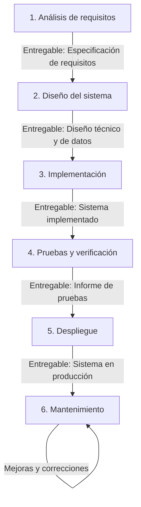
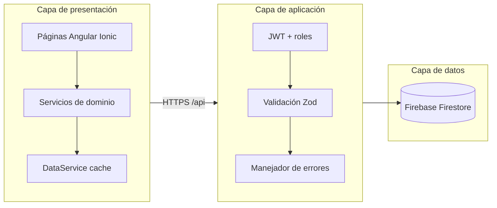
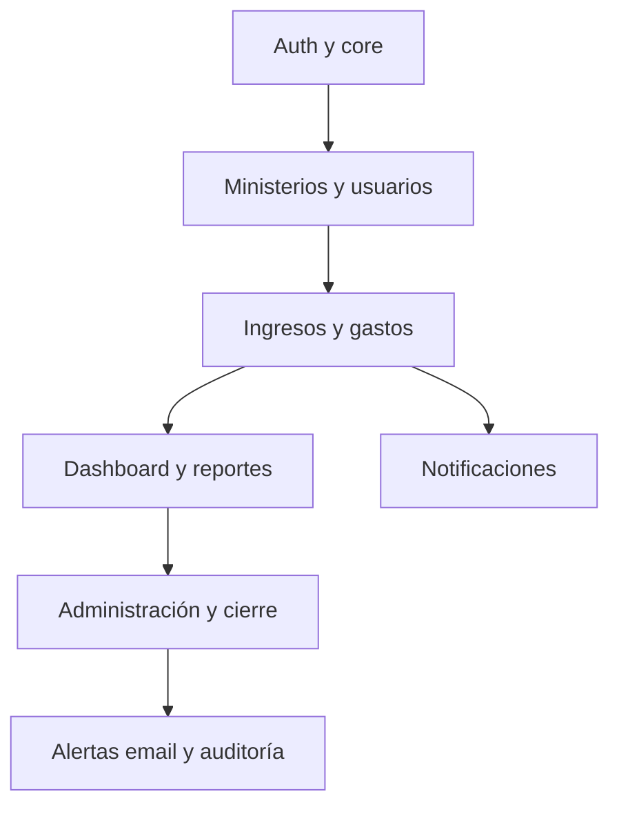

# Metodología del proyecto — Gestión Financiera IECA

Documento de referencia sobre la metodología de desarrollo del sistema web de administración financiera de la **Iglesia Evangélica La Alborada (IECA)**.

---

## 1. Introducción

### 1.1 Contexto

El proyecto consiste en un **sistema web de gestión financiera** para uso interno de IECA. Permite registrar ingresos y gastos por ministerio, controlar aprobaciones, generar reportes, cerrar periodos contables y administrar usuarios con distintos niveles de acceso.

| Aspecto | Descripción |
|---------|-------------|
| **Producto** | Panel administrativo web (navegador de escritorio). |
| **Usuarios finales** | Administrador, contable y líderes/co-líderes de ministerio. |
| **Stack tecnológico** | Angular 20 + Ionic 8 (frontend) · Node.js + Express 5 (API) · Firebase Firestore (datos). |
| **Alcance** | Aplicación web institucional; despliegue móvil fuera del alcance de esta fase. |
| **Equipo** | Desarrollo académico e institucional (equipo reducido). |

### 1.2 Metodología adoptada: **Modelo en cascada (Waterfall)**

Se adopta el **modelo en cascada** como metodología principal del proyecto. Este enfoque organiza el desarrollo en **fases secuenciales**: cada fase debe completarse y validarse antes de iniciar la siguiente, con entregables documentados al cierre de cada etapa.

**Características del modelo aplicado:**

- Requisitos definidos y documentados al inicio del proyecto.
- Diseño del sistema antes de la codificación.
- Implementación completa según especificaciones de diseño.
- Pruebas sistemáticas sobre el producto construido.
- Despliegue una vez superadas las pruebas.
- Mantenimiento posterior a la puesta en producción.

**Justificación de la elección:**

1. Las **reglas de negocio contables** (aprobaciones, periodos cerrados, roles) son estables y deben quedar bien definidas desde el análisis.
2. La **arquitectura en capas** (frontend, API, base de datos) se puede diseñar de forma completa antes de implementar.
3. El proyecto académico requiere **trazabilidad clara** entre requisitos, diseño, código y pruebas.
4. El alcance funcional principal (CRUD de movimientos, reportes, administración, auth) está **delimitado** para la entrega del sistema.

---

## 2. Modelo en cascada — Visión general

| Fase | Objetivo | Criterio de cierre |
|------|----------|-------------------|
| 1. Análisis | Definir qué debe hacer el sistema | Requisitos validados con el stakeholder |
| 2. Diseño | Definir cómo se construirá | Arquitectura y modelos de datos aprobados |
| 3. Implementación | Construir el sistema | Código completo según diseño |
| 4. Pruebas | Verificar calidad y cumplimiento | Casos de prueba superados |
| 5. Despliegue | Poner el sistema en operación | Entorno productivo funcional |
| 6. Mantenimiento | Sostener y evolucionar el sistema | Incidencias y mejoras gestionadas |

---

## 3. Fase 1 — Análisis de requisitos

### 3.1 Objetivo

Recopilar, analizar y documentar las necesidades de IECA para transformarlas en requisitos funcionales y no funcionales verificables.

### 3.2 Actividades

1. Entrevistas y consultas con administración, contabilidad y líderes de ministerio.
2. Identificación de actores y casos de uso del sistema.
3. Definición de reglas de negocio contables.
4. Delimitación del alcance (incluido / excluido).
5. Redacción de la especificación de requisitos.

### 3.3 Actores del sistema

| Actor | Descripción |
|-------|-------------|
| **Administrador** | Acceso total: usuarios, ministerios, cierre, backup, auditoría. |
| **Contable** | Aprueba/rechaza movimientos; accede a reportes; sin gestión de usuarios. |
| **Líder / co-líder** | Registra ingresos/gastos de su ministerio en estado pendiente. |

### 3.4 Requisitos funcionales principales

| ID | Requisito | Descripción |
|----|-----------|-------------|
| RF-01 | Autenticación | Login con JWT, recuperación de contraseña, cambio obligatorio en primer acceso. |
| RF-02 | Gestión de ingresos | CRUD, comprobantes, filtros, estados pendiente/aprobado/rechazado. |
| RF-03 | Gestión de gastos | CRUD, categorías, comprobantes, aprobación por contable/admin. |
| RF-04 | Flujo de aprobación | Líder crea pendiente; contable o admin aprueba o rechaza. |
| RF-05 | Ministerios | CRUD de departamentos con líder y co-líder (solo admin). |
| RF-06 | Usuarios | CRUD con roles, contraseña temporal en alta. |
| RF-07 | Dashboard | KPIs, gráficos y últimos movimientos (solo aprobados). |
| RF-08 | Reportes | Filtros por periodo, ministerio y tipo; exportación Excel. |
| RF-09 | Cierre mensual | Bloqueo de periodos; movimientos del mes marcados como cerrados. |
| RF-10 | Administración | Backup/restauración JSON, auditoría CSV, alertas por email. |
| RF-11 | Notificaciones | Alertas de pendientes y eventos del sistema por usuario. |

### 3.5 Reglas de negocio clave

- Solo los movimientos en estado **aprobado** cuentan en balance, gráficos y reportes consolidados.
- Los **periodos cerrados** impiden altas, ediciones y borrados en ese mes.
- Los **líderes** solo ven y operan sobre su `ministerioId`.
- El **cierre mensual** procesa movimientos por lotes (hasta 500 operaciones por lote en Firestore).

### 3.6 Requisitos no funcionales

| ID | Requisito | Criterio |
|----|-----------|----------|
| RNF-01 | Seguridad | Contraseñas con bcrypt; JWT access/refresh; Helmet; rate limiting. |
| RNF-02 | Validación | Esquemas Zod en API; guards e interceptors en frontend. |
| RNF-03 | Usabilidad | Interfaz de escritorio en navegador; sidebar fijo; toasts consistentes. |
| RNF-04 | Disponibilidad | API en Render; frontend en Firebase Hosting. |
| RNF-05 | Mantenibilidad | Código modular por capas; utilidades puras testeables. |
| RNF-06 | Trazabilidad | Auditoría de login y movimientos; exportación CSV. |

### 3.7 Entregable de la fase

**Especificación de requisitos del sistema** — documento con actores, casos de uso, requisitos funcionales/no funcionales, reglas de negocio y alcance del proyecto.

**Criterio de aprobación:** validación por el administrador o contable de IECA antes de pasar a diseño.

---

## 4. Fase 2 — Diseño del sistema

### 4.1 Objetivo

Definir la arquitectura técnica, el modelo de datos, la estructura de la API y la organización del frontend conforme a los requisitos aprobados.

### 4.2 Actividades

1. Diseño de arquitectura en capas (cliente, API, persistencia).
2. Modelado de colecciones Firestore y relaciones.
3. Diseño de endpoints REST y contratos de datos.
4. Diseño de pantallas y flujos de navegación por rol.
5. Diseño de seguridad (JWT, roles, CORS, validación).
6. Plan de pruebas (unitarias, integración, manuales).

### 4.3 Arquitectura general

### 4.4 Diseño de capas

| Capa | Ubicación | Responsabilidad |
|------|-----------|-----------------|
| **Presentación** | `src/app/pages/`, `components/` | UI Ionic; lógica de presentación en utilidades |
| **Servicios** | `src/app/services/` | Cache, HTTP, agregación (`DataService`) |
| **Core** | `src/app/core/` | Guards, interceptors, modelos, auth |
| **API** | `server/src/routes/`, `utils/` | Reglas de negocio, validación, Firestore Admin |
| **Utilidades** | `shared/utils/`, `server/src/utils/` | Lógica pura reutilizable y testeable |

### 4.5 Modelo de datos (Firestore)

| Colección | Campos principales |
|-----------|-------------------|
| `usuarios` | `usuario`, `email`, `rol`, `passwordHash`, `ministerioId`, `estado` |
| `ministerios` | `nombre`, `estado`, líderes asignados |
| `ingresos` | Monto, fecha, ministerio, cuenta, estado, comprobante, auditoría |
| `gastos` | Monto, fecha, ministerio, categoría, estado, comprobante, auditoría |
| `notificaciones` | Usuario destino, tipo, ruta, leída |
| `config/sistema` | Periodos cerrados, último cierre |
| `login_auditoria` | Intentos de login (éxito/fallo) |

### 4.6 Diseño de módulos funcionales

| Módulo | Rutas frontend | Endpoints API |
|--------|----------------|---------------|
| Auth | `/login`, `/recuperar-password`, `/cambiar-password` | `/auth/*` |
| Dashboard | `/dashboard` | Agregación vía servicios |
| Ingresos / Gastos | `/ingresos`, `/gastos` | CRUD + `/aprobar`, `/rechazar` |
| Reportes | `/reportes` | Consultas filtradas |
| Usuarios / Ministerios | `/usuarios`, `/ministerios` | CRUD (solo admin) |
| Administración | `/administracion` | `/admin/*` |

### 4.7 Diseño de seguridad

- **Autenticación:** JWT access (15 min) + refresh (7 días).
- **Autorización:** `requireRoles` en API; `authGuard` y `roleGuard` en rutas.
- **Validación de entrada:** Zod en auth, CRUD, notificaciones y admin.
- **Protección HTTP:** Helmet, CORS explícito, rate limiting en login y API.

### 4.8 Entregable de la fase

**Documento de diseño del sistema** — diagramas de arquitectura, modelo de datos, catálogo de endpoints, mapa de pantallas y matriz rol–permiso.

**Criterio de aprobación:** coherencia con la especificación de requisitos (Fase 1) y revisión técnica del diseño.

---

## 5. Fase 3 — Implementación (codificación)

### 5.1 Objetivo

Construir el sistema completo según el diseño aprobado, respetando la arquitectura definida y las reglas de negocio documentadas.

### 5.2 Actividades

1. Configuración del entorno de desarrollo (Node.js, Firebase, variables de entorno).
2. Implementación del backend (Express, rutas, middleware, utilidades).
3. Implementación del frontend (páginas, servicios, componentes compartidos).
4. Integración frontend–API (proxy en desarrollo, `apiUrl` en producción).
5. Implementación de exportación Excel, notificaciones y alertas por correo.
6. Control de versiones con Git y revisión de código.

### 5.3 Orden de implementación por módulo

Siguiendo el diseño, la codificación se organizó por módulos dependientes:

| Orden | Módulo | Componentes principales |
|-------|--------|-------------------------|
| 1 | Auth | Login, JWT, guards, recuperación de contraseña |
| 2 | Ministerios / Usuarios | CRUD admin, asignación de líderes |
| 3 | Ingresos / Gastos | Formularios, tabla, aprobación, comprobantes |
| 4 | Dashboard | KPIs, Chart.js, movimientos recientes |
| 5 | Reportes | Filtros, Excel, impresión |
| 6 | Administración | Cierre mensual, backup, auditoría |
| 7 | Notificaciones / Alertas | Campana UI, emails operativos |

### 5.4 Estándares de codificación

- **TypeScript** en frontend y backend.
- **Separación de responsabilidades:** UI en componentes; lógica en `shared/utils/` y `server/src/utils/`.
- **Lazy loading** de páginas principales (`loadComponent`).
- **Mensajes de commit** descriptivos en español.
- **Lint** con ESLint (Angular) antes de integrar cambios.

### 5.5 Entregable de la fase

**Código fuente del sistema** — repositorio con frontend (`src/`), API (`server/src/`), configuración y scripts documentados en README.

**Criterio de cierre:** todos los requisitos funcionales de la Fase 1 implementados según el diseño de la Fase 2.

---

## 6. Fase 4 — Pruebas y verificación

### 6.1 Objetivo

Verificar que el sistema cumple los requisitos, respeta las reglas de negocio y funciona correctamente en todos los roles definidos.

### 6.2 Actividades

1. Elaboración del plan de pruebas a partir de requisitos y casos de uso.
2. Ejecución de pruebas unitarias automatizadas.
3. Ejecución de pruebas de integración HTTP en la API.
4. Pruebas manuales por rol (admin, contable, líder).
5. Registro de incidencias y corrección en implementación.
6. Validación final con el usuario institucional.

### 6.3 Tipos de prueba

| Tipo | Herramienta | Ámbito | Casos representativos |
|------|-------------|--------|----------------------|
| **Unitarias (frontend)** | Karma + Jasmine | Utilidades y servicios | Filtros, validación, KPIs solo aprobados |
| **Unitarias (backend)** | Node test runner | Lógica pura, schemas | Periodos, cierre mensual, tokens JWT |
| **Integración HTTP** | Supertest | Endpoints API | Login, refresh, cierre, conflictos 409 |
| **Smoke** | Karma | Componentes | Creación de pantallas principales |
| **Manuales** | Navegador escritorio | Flujos E2E por rol | Aprobar, rechazar, periodo cerrado, Excel |

### 6.4 Matriz requisito — prueba

| Requisito | Verificación |
|-----------|--------------|
| RF-04 Flujo de aprobación | Líder crea pendiente; contable aprueba; aparece en dashboard |
| RF-09 Cierre mensual | Tras cierre, no se puede editar movimiento del periodo |
| RF-01 Auth | Login, refresh token, cambio de contraseña obligatorio |
| RNF-01 Seguridad | Rate limit login; JWT rechazado sin token; bcrypt en contraseñas |

### 6.5 Resumen de cobertura automatizada

| Ámbito | Casos | Herramienta |
|--------|-------|-------------|
| Frontend | 35 | Karma + Jasmine + ChromeHeadless |
| Backend | 42 | Node.js test runner + Supertest |
| **Total** | **77** | Replicado en GitHub Actions (CI) |

### 6.6 Integración continua (verificación automática)

El workflow `.github/workflows/ci.yml` ejecuta en cada push y pull request:

- Frontend: `lint` → `test:ci` → `build:ci`
- Backend: `typecheck` → `build` → `npm test`

### 6.7 Entregable de la fase

**Informe de pruebas** — plan ejecutado, resultados por tipo de prueba, incidencias detectadas y resueltas, confirmación de cumplimiento de requisitos.

**Criterio de cierre:** todos los casos críticos superados; CI en verde; validación manual por rol completada.

---

## 7. Fase 5 — Despliegue (instalación)

### 7.1 Objetivo

Instalar y configurar el sistema en el entorno de producción para uso institucional de IECA.

### 7.2 Actividades

1. Build de producción del frontend (`npm run build:ci` → carpeta `www/`).
2. Compilación de la API (`server/npm run build` → carpeta `dist/`).
3. Configuración de Firebase Hosting para el frontend.
4. Configuración del Web Service en Render para la API.
5. Variables de entorno de producción (`JWT_SECRET`, `CORS_ORIGINS`, credenciales Firebase).
6. Verificación post-despliegue (`/api/health`, login, flujo básico).
7. Cambio de contraseñas temporales del seed inicial.

### 7.3 Entornos

| Entorno | Propósito | Configuración |
|---------|-----------|---------------|
| **Desarrollo** | Codificación y pruebas locales | `npm start` + `server/npm run dev`, proxy `/api` |
| **CI** | Verificación automática | Firestore en memoria, JWT de prueba |
| **Producción** | Uso institucional | Firebase Hosting + Render |

### 7.4 Pipeline de release

El workflow `.github/workflows/release.yml` genera artefactos tras CI exitoso:

| Artefacto | Contenido |
|-----------|-----------|
| `ieca-frontend-www` | Sitio estático (`www/`) |
| `ieca-server` | API compilada (`dist/`) con dependencias de producción |

### 7.5 Checklist pre-producción

- [ ] `NODE_ENV=production`
- [ ] `JWT_SECRET` único (≥ 32 caracteres)
- [ ] `CORS_ORIGINS` con dominios HTTPS del frontend
- [ ] Credenciales Firebase configuradas en Render
- [ ] `environment.prod.ts` con `apiUrl` correcto
- [ ] `npm run verify:prod` superado
- [ ] Contraseñas del seed cambiadas
- [ ] SMTP configurado (recuperación y alertas), si aplica

Detalle completo en **[DEPLOY.md](./DEPLOY.md)**.

### 7.6 Entregable de la fase

**Sistema desplegado en producción** — URLs operativas, configuración documentada, checklist completado.

**Criterio de cierre:** health check OK, login funcional y acceso por rol verificado en producción.

---

## 8. Fase 6 — Mantenimiento

### 8.1 Objetivo

Garantizar la operación continua del sistema, corregir incidencias y aplicar mejoras acordadas con IECA una vez en producción.

### 8.2 Actividades

1. Monitoreo del API (`/api/health`) y disponibilidad del hosting.
2. Corrección de errores reportados por usuarios.
3. Ajustes de permisos, mensajes o filtros según feedback operativo.
4. Ejecución de backups periódicos desde el panel de administración.
5. Alertas operativas por correo (pendientes antiguos, aviso de cierre de mes).
6. Actualización de dependencias y parches de seguridad.

### 8.3 Tipos de mantenimiento

| Tipo | Descripción | Ejemplo en IECA |
|------|-------------|-----------------|
| **Correctivo** | Reparar fallos | Error en filtro de auditoría, CI roto |
| **Adaptativo** | Ajustar a cambios del entorno | Nueva URL de API, credenciales Firebase |
| **Perfectivo** | Mejorar funcionalidad existente | Mensajes de confirmación, toasts unificados |
| **Preventivo** | Evitar fallos futuros | Tests de cierre mensual, backup antes de cierre |

### 8.4 Gestión de incidencias y cambios

En mantenimiento, todo cambio sigue el flujo:

1. **Reporte** — usuario o desarrollador identifica el problema o mejora.
2. **Análisis** — impacto en requisitos y reglas de negocio.
3. **Corrección / mejora** — cambio en código acotado al módulo afectado.
4. **Verificación** — pruebas + CI en verde.
5. **Despliegue** — release a producción.
6. **Cierre** — confirmación con el usuario institucional.

### 8.5 Entregable continuo

- Registro de incidencias resueltas.
- Versiones desplegadas (tags `v*` en GitHub).
- Documentación actualizada (README, DEPLOY, este documento).

---

## 9. Roles en el proyecto

| Rol | Participación por fase |
|-----|------------------------|
| **Administrador IECA** | Valida requisitos (F1); prueba administración y cierre (F4–F5); reporta incidencias (F6). |
| **Contable** | Valida flujos de aprobación y reportes (F1, F4); usuario final en producción (F5–F6). |
| **Líder / co-líder** | Valida registro de movimientos por ministerio (F1, F4). |
| **Desarrollador** | Diseño técnico (F2), implementación (F3), pruebas (F4), despliegue (F5), mantenimiento (F6). |

---

## 10. Herramientas utilizadas

| Categoría | Herramienta | Fase principal |
|-----------|-------------|----------------|
| Control de versiones | Git, GitHub | F3, F6 |
| Frontend | Angular 20, Ionic 8, TypeScript, SCSS | F2, F3 |
| Backend | Express 5, TypeScript, Zod | F2, F3 |
| Base de datos | Firebase Firestore | F2, F3, F5 |
| Pruebas | Karma, Jasmine, Node test runner, Supertest | F4 |
| CI/CD | GitHub Actions | F4, F5 |
| Hosting | Firebase Hosting, Render | F5 |
| Documentación | Markdown (`docs/`, README) | Todas |

---

## 11. Riesgos del modelo en cascada y mitigaciones

| Riesgo | Descripción | Mitigación aplicada |
|--------|-------------|---------------------|
| Requisitos incompletos al inicio | Descubrir necesidades tarde | Validación con admin/contable antes de diseño; documentación detallada en README |
| Costo de cambios en fases tardías | Modificar diseño ya implementado | Diseño modular por dominio; utilidades desacopladas |
| Entrega tardía de valor | Usuario no ve el sistema hasta el final | Entregables parciales por módulo dentro de la fase de implementación |
| Regresiones en despliegue | Fallos al pasar a producción | CI automatizado, checklist DEPLOY, health check |

---

## 12. Trazabilidad del proyecto

La trazabilidad en cascada exige poder seguir cada funcionalidad desde el requisito hasta la prueba:

| Requisito | Diseño | Implementación | Prueba |
|-----------|--------|----------------|--------|
| RF-02 Ingresos | `pages/ingresos`, CRUD API | `ingresos.component`, `ingresos.routes` | `movimiento-filtros.util.spec.ts`, manual por rol |
| RF-09 Cierre | `admin.routes`, `cierre-mensual.ts` | Panel administración | `cierre-mensual.test.js`, `http.integration.test.js` |
| RF-01 Auth | JWT, guards | `auth.routes`, `authGuard` | `auth.test.js`, login manual |

---

## 13. Referencias internas

- [README.md](../README.md) — Visión general, API, roles, scripts.
- [DEPLOY.md](./DEPLOY.md) — Despliegue y checklist de producción.
- [.github/workflows/ci.yml](../.github/workflows/ci.yml) — Integración continua.
- [.github/workflows/release.yml](../.github/workflows/release.yml) — Artefactos de release.

---

*Proyecto privado — uso académico e institucional para IECA (Iglesia Evangélica La Alborada).*

*Metodología: modelo en cascada (Waterfall).*
