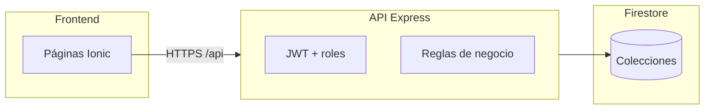

# Propuesta de solución

**Sistema Web de Gestión Financiera — Iglesia Evangélica La Alborada (IECA)**

Documentos relacionados: [ENTREGABLES.md](./ENTREGABLES.md) · [REQUERIMIENTOS.md](./REQUERIMIENTOS.md) · [CASOS-DE-USO.md](./CASOS-DE-USO.md) · [VERIFICACION.md](./VERIFICACION.md)

---

## 1. Planteamiento

La propuesta consiste en un **Sistema Web de Gestión Financiera** para IECA, orientado al uso en **navegador de escritorio** por administradores, contables y colaboradores de ministerio.

Sustituye el registro manual disperso por un panel centralizado con trazabilidad, roles, aprobaciones y reportes con kardex por ministerio.

---

## 2. Arquitectura de la solución

La solución se estructura en **tres capas**:

| Capa | Tecnología | Responsabilidad |
|------|------------|-----------------|
| **Presentación** | Angular 20 + Ionic 8 | Panel web, formularios, tablas, reportes, exportación Excel |
| **Aplicación** | Node.js + Express 5 | API REST, JWT, validación Zod, reglas de negocio |
| **Datos** | Firebase Firestore | Usuarios, ministerios, ingresos, gastos, configuración |

La seguridad se gestiona con **JWT** (access + refresh), **roles** (Administrador, Contable, Colaborador) y **validación de entrada** en API y formularios.

---

## 3. Módulos funcionales

Cuatro módulos agrupan **18 casos de uso**:

| Módulo | Funcionalidad principal |
|--------|-------------------------|
| **Seguridad y Acceso** | Login, recuperar/cambiar contraseña, notificaciones |
| **Gestión Financiera** | Ingresos, gastos, aprobación/rechazo, alcance por ministerio |
| **Reportes y Analítica** | Dashboard, filtros, kardex, Excel |
| **Administración** | Ministerios, usuarios, cierre, backup, auditoría, alertas email |

Detalle de casos de uso: [CASOS-DE-USO.md](./CASOS-DE-USO.md).

---

## 4. Reglas de negocio destacadas

| Regla | Descripción |
|-------|-------------|
| **Aprobación** | Colaborador crea en `pendiente`; solo el administrador aprueba o rechaza. |
| **Aportación iglesia** | Ingresos de talento (cuenta **4105**): **33 %** automático a ministerio **General**; el ministerio retiene **67 %**. |
| **Kardex** | Saldo histórico por ministerio (solo movimientos aprobados), calculado en cliente. |
| **Cierre mensual** | Periodos cerrados bloquean altas, ediciones y borrados en ese mes. |
| **Roles** | Contable consulta y reporta; no aprueba. Colaborador solo ve su `ministerioId`. |

Detalle completo: [REQUERIMIENTOS.md § Reglas de negocio](./REQUERIMIENTOS.md).

---

## 5. Despliegue y operación

| Componente | Plataforma |
|------------|------------|
| Frontend (panel) | Firebase Hosting — `https://gestion-ieca.web.app` |
| API REST | Render **Starter** — `https://ieca-api.onrender.com/api` (siempre activo) |
| Base de datos | Firebase Firestore |

Guía de despliegue: [DEPLOY.md](./DEPLOY.md).

---

## 6. Evidencia de funcionamiento

El **prototipo** está construido y desplegado. Su funcionamiento se evidencia en:

| Evidencia | Detalle |
|-----------|---------|
| **Caso ingreso #13** | Andrés Quinde — $182,00 bruto — saldo kardex **$41,94** — [IMPLEMENTACION.md](./IMPLEMENTACION.md) |
| **Pruebas automatizadas** | 184 casos (117 frontend + 67 backend) — 184 pass |
| **Aceptación manual** | 8 casos CP-M01…CP-M08 verificados |
| **Dataset demo** | `backup-demo-ieca.json` — 182 usuarios según lista IECA 2024 |

Informe completo: [VERIFICACION.md](./VERIFICACION.md).

---

## 7. Alcance y exclusiones

### Incluido

- Panel web de escritorio para administración financiera por ministerio.
- Flujo de aprobación, reportes, kardex, cierre mensual, backup y alertas.
- Despliegue en Firebase Hosting + Render.

### Excluido

- App móvil nativa (Android/iOS).
- Integración bancaria o facturación electrónica.
- Contabilidad de partida doble completa.

---

*Metodología: cascada (Waterfall) — ver [METODOLOGIA.md](./METODOLOGIA.md).*
